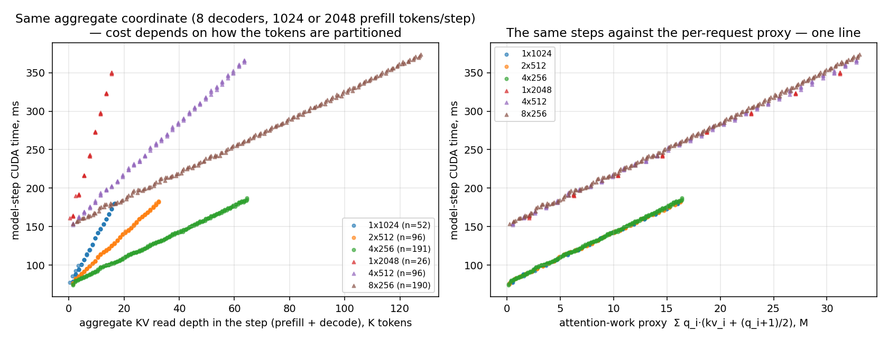

# Single-GPU Inference Lab

[](https://github.com/yinli-systems/single-gpu-inference-lab/actions/workflows/ci.yml)

Falsifiable systems results on LLM inference, measured end to end on one NVIDIA
L20 with vLLM, from the API server through the scheduler to the GPU and the KV
memory hierarchy. Every claim links to a checked-in artifact with raw data,
exact commands, provenance hashes and the negative results that bound it.

The question the lab keeps asking has moved outward over time:

> Where does inference performance actually come from once the framework,
> the scheduler, CUDA graphs and production baselines are included — and
> which plausible optimizations survive a pre-registered kill gate?

**Start here:** [When Token Budgets Lie](docs/when-token-budgets-lie.md) (technical report) ·
[result index](benchmarks/results/README.md) ·
[experiment status ledger](docs/experiment-status.md) ·
[reviewer guide](docs/reviewer-guide.md) ·
[repository map](docs/repo-map.md)

## Research lines (2026-09)

| Line | Question | Result | Evidence |
| --- | --- | --- | --- |
| **A · RL rollout data path** | Why does asking vLLM for one logprob per token cost 30% of throughput, and where does the cost sit? | Located layer by layer: not the kernels, not detokenization, but per-request `LogprobsLists` slicing → IPC → output processor → Pydantic objects. An exact flat `token_logprobs` fast path restores **0.67× → 0.95–0.96×** of native on Qwen2.5-0.5B and **0.99×** on Qwen3-4B; max abs diff vs the object path 0.0. Upstream: [vllm-project/vllm#57442](https://github.com/vllm-project/vllm/pull/57442). | [`l20-flat-token-logprobs/`](benchmarks/results/l20-flat-token-logprobs/README.md), [`l20-logprob-engine-decomposition/`](benchmarks/results/l20-logprob-engine-decomposition/README.md), [`l20-vllm-sampling-mask-ab/`](benchmarks/results/l20-vllm-sampling-mask-ab/README.md) (independent replication of [#54901](https://github.com/vllm-project/vllm/pull/54901)) |
| **B · Prefill cost geometry** | Is the aggregate coordinate used by deadline-aware chunked-prefill schedulers (decode batch, aggregate KV, prefill tokens) sufficient on a real engine? | No, in one specific way: it aliases partitions of the same prefill budget whose measured step costs differ **up to 1.9×** (1×2048 vs 8×256 tokens at equal batch, context and token count). One per-request attention-work term Σqᵢ(kvᵢ+(qᵢ+1)/2) explains it; geometry-OOD prediction error **341 ms → 8.3 ms** MAE; a live 100 ms-deadline controller carrying it delivers **+49–180%** safe prefill progress over the aggregate controller at zero violations — and only **+5–12%** over a hindsight-tuned fixed budget. Context shift, load shift, decode-KV skew, CUDA-graph boundaries and FCFS short-prompt bursts are all handled by the aggregate coordinate (negative results, recorded). | [`l20-prefill-cost-geometry/`](benchmarks/results/l20-prefill-cost-geometry/README.md), report [`docs/when-token-budgets-lie.md`](docs/when-token-budgets-lie.md); precursors [`l20-prefill-interference/`](benchmarks/results/l20-prefill-interference/README.md), [`l20-step-cost-shift/`](benchmarks/results/l20-step-cost-shift/README.md) |
| **C · Heterogeneous pre-draft K** (speculative decoding) | Does choosing K per request *before* drafting recover draft work that adaptive verification only trims afterwards? | **Killed.** The DSpark draft pass is per-row-fixed (K=2→7 costs +5–20%), DSpark blocks are not prefix-invariant (small K loses 14–16% of positions), and the composed oracle is 0.94–1.00× of shipped adaptive verification. | [`l20-spec-decode-geometry/`](benchmarks/results/l20-spec-decode-geometry/README.md) (merged in #13) |
| **D · Adaptive-verification cost profile** | Does the startup-static synthetic cost profile mis-price real context, and does that change the verification budget? | **Killed.** The profile is wrong by +6…+55 ms per step (2.3× at 6k context, even with a matched profile context), but the ratio-argmax budget is insensitive: one-tier shift for low-acceptance content only, hindsight regret 0–3%. A cost model can be wrong by 2× and the controller still nearly regret-free. | [`l20-adaptive-verification-profile/`](benchmarks/results/l20-adaptive-verification-profile/README.md) (merged in #13) |
| **E · Request-free KV prefetch for paused agent sessions** | How much of an agent's resume latency is the CPU→GPU KV reload, can it be hidden during the tool wait, and what does that cost the rest of the engine? | Oracle prefetch cuts resume TTFT **−52…−58%** for 4k–16k prefixes (load 6.4 µs/token; the useful lead is exactly the load time). Timing predictors are fragile under lognormal tool waits — *prefetch immediately* recovers 95–100% of the oracle. Under sustained occupancy every admission policy, even oracle-ordered, is worse than reactive (+10…+57%): prefetch pays only into slack, so the right gate is `free_blocks − reserve ≥ session_blocks`, not a utility ranking. | [`l20-kv-prefetch-oracle/`](benchmarks/results/l20-kv-prefetch-oracle/README.md) (merged in #14); upstream primitive in [`upstream/vllm-kv-request-free-prefetch/`](upstream/vllm-kv-request-free-prefetch/) |
| **F · Multi-GPU DP/EP synchronization** (2× RTX 4090) | When data-parallel ranks rendezvous every step (DP coordination, per-layer expert-parallel collectives), which per-rank costs leak to the other rank? | Four pre-registered screens. **Killed:** cross-rank CUDA-graph padding amplification (graph-vs-eager oracle gain 0.0%), spec-decode acceptance skew (ITL ×1.02 — equal step periods, nothing to drag), and logprobs / structured output contagion (≤2%). **Measured:** bulk KV offload traffic hurts the peer rank only through host topology (cross-socket pair + far-socket buffer ×1.45–1.48 peer ITL; same socket ×1.03–1.13); vLLM's CPU offload connector puts the storing rank into a sustained CPU-side slow state that lockstep exports to the peer (store-cell p95 ×1.72, 5 repeats) — core reservation removes the sustained state but leaves ×1.2, so the mechanism is still open. | [`dp-ep-g1-padding/`](benchmarks/results/dp-ep-g1-padding/README.md), [`dp-ep-c21-contagion/`](benchmarks/results/dp-ep-c21-contagion/README.md), [`dp-ep-c26-pcie/`](benchmarks/results/dp-ep-c26-pcie/README.md), [`dp-ep-c27-spec-skew/`](benchmarks/results/dp-ep-c27-spec-skew/README.md), ledger [`docs/multigpu-opportunity-ledger.md`](docs/multigpu-opportunity-ledger.md) |



*Line B, figure 1: six partitions of the same prefill budget against the aggregate KV coordinate (left) and against the per-request attention-work proxy (right).*

## Upstream optimizations (2026-09)

Changes to vLLM and Transformers found and measured here. Each is a patch plus the harness and
raw results behind it in [`upstream/`](upstream/README.md); equivalence is always tested against
the unmodified code in the same environment, never asserted.

| Optimization | Where | Measured effect | Equivalence evidence | Status |
| --- | --- | --- | --- | --- |
| Sampled-token logprob fast path — one float per token instead of per-token `Logprob` objects from scheduler to response | vLLM `/inference/v1/generate` | Throughput with logprobs **0.67× → 0.95–0.96×** of no-logprobs (Qwen2.5-0.5B), **0.99×** (Qwen3-4B); response 41 → 6.8 KB per request | Max abs diff 0.0 vs the object path (batch-invariant) | [vllm#57442](https://github.com/vllm-project/vllm/pull/57442) open |
| Integer token IDs for generate logprobs (`GenerateLogProbs`: `token_id`, `rank`, rank-ordered `top_logprobs`) | vLLM generate API, Python + Rust frontends, derender | Removes the `"token_id:N"` string round trip; protocol change, not a speed claim | Rust 9/9, Python 7/7 | [vllm#58181](https://github.com/vllm-project/vllm/pull/58181) open; shape agreed on [#57574](https://github.com/vllm-project/vllm/issues/57574) |
| Request-free CPU→GPU KV prefetch primitive (reserve-gated, never evicts, no predictor) | vLLM `OffloadingConnector` | Hides the resume reload measured in line E (resume TTFT **−52…−58%** oracle) | 12 new tests; offloading suite failure set identical to unmodified main | Invited on [vllm#57103](https://github.com/vllm-project/vllm/issues/57103); pushed to fork |
| Beam search: rank the 2·B² candidates before building their token/logprob histories | vLLM offline beam search | CPU per step B=32, 4096-token prompt **52.8 → 1.5 ms**; end to end (L20, Qwen2.5-0.5B) prompt 2048 B=32 **3.20 → 1.64 s (1.95×)**, prompt 128 B=32 **1.85×** | 640 runs byte-identical (CPU); GPU **bit-identical** under batch invariance | Local patch |
| Beam search + grammars: no dense allowed-token list/set per beam per step | vLLM offline beam search, structured outputs | Grammar work per step B=32 **206–217 → 6.3–6.9 ms**; end to end JSON schema B=32 **15.6 → 4.1 s (3.76×)**, B=16 **2.29×**, B=8 **1.53×** | 56 real xgrammar states identical; GPU **bit-identical** under batch invariance | Local patch |
| Stop-string preprocessing via native `find` | Transformers `StopStringCriteria` | Real 151k vocab: helper **4.6–12.2×**, full cache miss **2.1–3.8×** (8 stops 3.18 → 0.84 s); cache holds only 8 stop-string sets | 336/336 differential checks | Measured, not submitted |

Beam end-to-end numbers alternate stock and patched vLLM 0.29.0 runs on the L20 (5 timed calls
per cell, stock-vs-stock agreement shown); at beam width ≤ 8 without grammars the effect is within
noise. Not yet measured: larger models, and a server-backed run of the #58181 / prefetch tests on
a real `main` build.

## How the lab works

Each line follows the same protocol, and the artifact records where it stopped:

```text
measurement contract          trace coverage, on/off overhead, host wait ≠ GPU time,
                              direct CUDA timing agreement — before any conclusion
       ↓
upper bound / falsification   oracle or composed bound with coverage labels
                              (measured / interpolated / extrapolated); pre-registered gate
       ↓
minimal implementation        env-gated experiment patch, never a framework
       ↓
live A/B                      fresh server per condition, interleaved, ≥3 repeats,
                              strongest safe baseline (hindsight-tuned where that is stronger)
       ↓
record                        positive, negative and superseded results with the same care
```

Lines C and D are as much a product of this protocol as A, B and E: each was
screened in under a day with an explicit kill line, and each left a mechanism
finding that the survivors rely on (why adaptive verification is robust, what
the draft pass actually costs). The
[experiment status ledger](docs/experiment-status.md) keeps every line, dead or
alive, and the [result index](benchmarks/results/README.md) plus
[machine-readable catalog](benchmarks/results/artifact-catalog.json) bind each
number to its artifact.

## Instrumentation and harnesses

Reusable pieces built for the lines above; all opt-in, all reversible:

| Piece | What it gives | Entry point |
| --- | --- | --- |
| Engine iteration + runner step tracer (v2–v4) | Per-iteration scheduler geometry (per-request chunks and KV depths), engine wait, direct CUDA step time, draft-pass time, adaptive-verification decisions; joined by sequence, not timestamp | [`benchmarks/results/l20-prefill-cost-geometry/patches/`](benchmarks/results/l20-prefill-cost-geometry/patches/), [`scripts/step_trace_join.py`](scripts/step_trace_join.py) |
| Prefill interference / deadline controller | Background decoders + injected long prefills; env-gated per-step prefill budget chooser with M0 / M2 cost models, online margin, equal or FCFS partition | [`scripts/measure_prefill_interference.py`](scripts/measure_prefill_interference.py), [`scripts/analyze_step_cost_v2.py`](scripts/analyze_step_cost_v2.py), [`scripts/replay_prefill_controller.py`](scripts/replay_prefill_controller.py), [`scripts/analyze_live_controller.py`](scripts/analyze_live_controller.py) |
| Speculative-decoding geometry | Closed batches by prompt class and batch size; draft vs verify split; per-request acceptance | [`scripts/measure_spec_geometry.py`](scripts/measure_spec_geometry.py), [`scripts/analyze_spec_geometry.py`](scripts/analyze_spec_geometry.py) |
| Feature-cost serving A/B | One server per condition, `/proc` CPU split per process, output dumps, port guard | [`scripts/measure_vllm_feature_cost.py`](scripts/measure_vllm_feature_cost.py) |

## Operator-level work (earlier)

The lab began one layer down, asking which kernel optimizations still matter
after framework overhead. Those results stand and are kept to the same
evidence standard:

| Boundary | Measured result | Scope |
| --- | --- | --- |
| [Fused top-logprobs selection](src/l20_stack/ops/triton_sampling.py) | [**8.39x–9.45x**](benchmarks/results/a100-fused-top-logprobs/README.md) paired median speedup on A100 (pre-fix source) and [7.33x–8.25x](benchmarks/results/l20-fused-top-logprobs-2026-09/README.md) on L20 after the [2026-09 masked-tile fix](docs/top-logprobs-correctness-notice-2026-09.md); tie-aware correctness within `4.768e-7` | Steady-state, GEMM-conditioned operator microbenchmark; both dirty and clean A100 path-proof artifacts exist ([dirty](benchmarks/results/a100-vllm-top-logprobs-smoke/dirty-qwen25-05b-r2/README.md), [clean](benchmarks/results/a100-vllm-top-logprobs-clean/qwen25-05b-r30/README.md)); only the clean run is used for interpretation and its total request time is flat |
| [Sparse repetition penalty](integrations/vllm/cuda/l20_sparse_repetition_penalty.cu) | [39/39 correct; 1.26x median, 4.09x best](benchmarks/results/l20-sparse-repetition-penalty/README.md) with a measured dispatch gate | Standalone kernel matrix; [case study](docs/l20-sparse-penalty-case-study.md) |
| [Residual RMSNorm](src/l20_stack/ops/triton_rmsnorm.py) | [24/24 correct; fastest on 14/24 shapes, best 2.412x](benchmarks/results/l20-residual-rmsnorm-v3/README.md) | L20 FP16 microbenchmark |
| [Serving-path correctness audit](docs/sampling-correctness-notice-2026-07.md) | Historical custom-sampler serving numbers withdrawn until GPU remeasurement | Correctness takes precedence over a favorable number |

The hardware boundary is one L20 (SM89, 48 GB); A100 measurements are
controls and Apple M4 experiments mark the CPU deployment edge
([hardware policy](docs/hardware-scope.md)).

Operator-era review entry points (kept for the record; the logits-boundary
work is what first showed that the sampling kernels were not the serving
bottleneck and led to lines A–B):

| Topic | Path |
| --- | --- |
| Logits-boundary A/B plan | [`docs/logits-boundary-ab.md`](docs/logits-boundary-ab.md) |
| Top-tier kernel and profiling gaps | [`docs/l20-top-tier-kernel-gaps.md`](docs/l20-top-tier-kernel-gaps.md) |
| Serving optimization ceiling | [`benchmarks/results/l20-serving-optimization-ceiling/`](benchmarks/results/l20-serving-optimization-ceiling/) |
| vLLM logits-boundary scout | [`benchmarks/results/l20-vllm-logits-boundary-scout/`](benchmarks/results/l20-vllm-logits-boundary-scout/) |
| Logits-boundary trace installer | [`integrations/vllm/install_l20_logits_boundary_trace.py`](integrations/vllm/install_l20_logits_boundary_trace.py) |
| Trace summarizer | [`scripts/summarize_l20_logits_boundary_trace.py`](scripts/summarize_l20_logits_boundary_trace.py) |
| Trace campaign | [`scripts/run_vllm_l20_logits_boundary_trace_campaign.sh`](scripts/run_vllm_l20_logits_boundary_trace_campaign.sh) |
| Standalone top-k/top-p benchmark | [`scripts/benchmark_l20_topk_topp_sampling.py`](scripts/benchmark_l20_topk_topp_sampling.py) |
| Compact systems thesis | [`docs/where-optimizations-stop-mattering.md`](docs/where-optimizations-stop-mattering.md) |

## Reproduce and validate

CI is CPU-safe: it installs CPU PyTorch, validates artifact links, builds the
result catalog, runs the test suite and compiles the sources.

```bash
python -m venv .venv && source .venv/bin/activate
python -m pip install --upgrade pip
python -m pip install -e ".[dev]" numpy
python -m pip install torch --index-url https://download.pytorch.org/whl/cpu
python -m pytest -q
single-gpu-infer doc-links
single-gpu-infer artifact-catalog --output /tmp/artifact-catalog.json
```

GPU results need the hardware, model and vLLM version named in each artifact;
every campaign's exact server and harness command is checked in next to its
raw data (`benchmarks/results/<artifact>/raw/campaign*.sh`). Kernel builds
additionally need `python -m pip install -e ".[dev,kernels]"` and target SM89
by default (`TORCH_CUDA_ARCH_LIST=8.0` for A100 portability checks; A100
numbers are never presented as L20 results).

## Claim policy

- Name the hardware, model, workload, baseline and artifact for every number.
- Separate microbenchmark, path-proof and serving evidence; keep trace runs
  separate from latency runs.
- Pre-register the kill gate; report negative and mixed rows; never summarize
  a partial win as universal or a research margin as a product claim.
- Withdraw a claim when a later audit invalidates its comparator.
- Do not extrapolate L20 or A100 measurements to other GPU families.
- Keep weights, datasets, raw profiler databases, caches and secrets out of git.

## Repository map

| Path | Purpose |
| --- | --- |
| `benchmarks/results/` | One directory per artifact: README, raw JSON/JSONL, figures, patches, commands |
| `upstream/` | Patches aimed at vLLM / Transformers with their harnesses and raw results |
| `docs/` | Technical reports, status ledger, correctness notices, hardware scope |
| `scripts/` | Harnesses, analyzers, campaign runners, summarizers |
| `src/l20_stack/ops/` | Triton kernels and dispatch policies |
| `integrations/vllm/` | PyTorch custom ops, vLLM hooks, reversible installers |
| `cuda/`, `cpp/` | Standalone CUDA experiments; CPU / Apple M4 control track |
| `tests/` | CPU-safe behavioral, contract and source-level tests |

The public project name is **Single-GPU Inference Lab**; the Python namespace
remains `l20_stack` for compatibility with existing scripts and artifacts.
