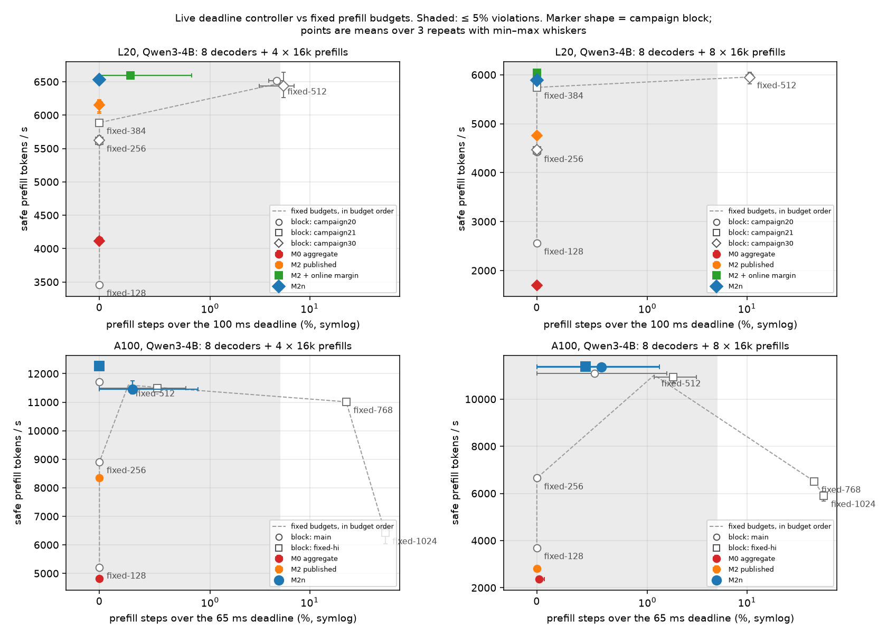

# Live deadline controller on the A100 (Qwen3-4B), pre-registered

**Question.** On the L20, a live deadline controller that prices steps with the geometry model
(M2) delivered +49–180% safe prefill progress over the same controller on the aggregate
coordinate (M0), but only +7–8% over the best safe fixed budget. Does that hold on a different
GPU, and does the pre-registered M2n (M2 without the aggregate prefill-KV term, see
[`prefill-geometry-attention-shape/`](../prefill-geometry-attention-shape/README.md)) change
the picture?

**Answer.**
- **Geometry vs aggregate.** Replicates, and M2n makes it much larger. M2n delivers
  **2.4× (N=4) and 4.8× (N=8)** M0's safe prefill throughput at ≤ 0.6% violations, and cuts
  TTFT from 13.7 s → 5.7 s and 56.0 s → 11.5 s.
- **The published M2 fails where predicted.** At 8 concurrent 16k prefills its aggregate
  prefill-KV term prices every candidate above the deadline, so it falls back to 64-token
  budgets: 2,806 tok/s, TTFT 46 s. That is only +18% over M0, and 4.0× below M2n.
- **Geometry vs the best fixed budget.** Does **not** clear the pre-registered 15% bar,
  exactly as on the L20. M2n picks the same operating point as the hindsight-best safe fixed
  budget (512 tokens) without tuning. Against it, M2n is −2% / +2% in the main block and +7% /
  +4% within the follow-up block. Every larger fixed budget violates the deadline on 23–59% of
  steps.

So on two GPUs, the value of the geometry-aware controller is that it finds the right budget
**without tuning** and does not collapse when the prefill mix changes; M0 and the published M2
both do collapse. It does not beat a budget tuned in hindsight for a fixed workload.

Pre-registration: addenda 2 and 3 of
[`docs/preregistration/2026-09-23-m2-without-aggregate-prefill-kv.md`](../../../docs/preregistration/2026-09-23-m2-without-aggregate-prefill-kv.md)
(committed 8ce9c7a before launch, and 5aefb1c before the follow-up block).



Every live controller run on both GPUs as safe prefill throughput against the share of prefill
steps over the deadline ([`scripts/plot_live_pareto.py`](../../../scripts/plot_live_pareto.py);
the numbers are in [`figures/live_pareto.json`](figures/live_pareto.json)). The fixed budgets trace
a frontier: throughput rises with the budget until the budget starts to break the deadline. M2n
lands at the safe end of that frontier on both GPUs, without tuning. On the A100 that point is
fixed-512. On the L20, where fixed-512 already violates 5–11%, M2n sits above fixed-384 at 0%
violations. The best fixed budget differs between the two GPUs (≈384 vs 512), so no single global
fixed budget is right for both. M0 sits at the bottom of every panel, and the published M2
collapses at A100 N=8.

## Setup

| item | value |
| --- | --- |
| hardware | A100-SXM4-80GB, GPU 0 of the RunPod pod (GPU 1 ran the Qwen2.5-7B shape campaign until 10:37, during the first 6 runs; repeat 1 matches repeats 2–3 within 1% in every arm) |
| engine | vLLM 0.29.0, tracer v2, controller from [`apply_deadline_controller.py`](../l20-prefill-cost-geometry/patches/apply_deadline_controller.py) at 8ce9c7a, installed into a **copy** of the venv so the shape campaign's venv never changed |
| workload | as L20 §5: 8 decoders (4096 output tokens) + N ∈ {4, 8} × 16k prefills injected together, `--max-num-batched-tokens 8192`, a fresh server per run, arms interleaved, 3 repeats ([`campaign/`](campaign/)) |
| deadline | **65 ms** on prefill-containing steps. Picked from the offline replay as closest to the L20 regime; at 50 ms every model controller was infeasible (fixed step cost ~38 ms + margin ~10 ms). The replay over-priced: live fixed-512 was safe where it predicted 14% violations |
| controller models | fit on A100 one-prefill steps only ([`models/`](models/); `replay_prefill_controller.py --export-models --exclude-over-median-x 10 --exclude-first-iteration`); q95 margins M0 10.69, M2 10.44, M2n 10.32 ms |
| metrics | [`scripts/analyze_live_controller.py`](../../../scripts/analyze_live_controller.py) `--deadline-ms 65`, as on L20: violations = traced CUDA step > deadline; safe prefill tok/s = prefill tokens in non-violating steps ÷ injected-prefill phase |

The controller's per-step decision records were not traced: the L20 exp-field tracer patch was
not installed, and it was not added mid-campaign to keep every run identical. The column
"prefill tokens/step" is the realized budget read from the CUDA trace.

## Main block (36 runs)

[`live-main.md`](live-main.md): mean (min–max) over 3 repeats.

| N | arm | violations > 65 ms | prefill step p95 | safe prefill tok/s | TTFT (s) | prefill tokens/step |
| ---: | --- | ---: | ---: | ---: | ---: | ---: |
| 4 | fixed-128 | 0.0% | 34.4 | 5,213 (5,205–5,218) | 12.57 | 128 |
| 4 | fixed-256 | 0.0% | 38.9 | 8,908 (8,907–8,909) | 7.47 | 256 |
| 4 | fixed-512 | 0.0% | 59.4 | 11,709 (11,702–11,713) | 5.74 | 512 |
| 4 | **M0** aggregate | 0.0% | 31.6 | 4,817 (4,791–4,853) | 13.65 | 64 |
| 4 | **M2** published | 0.0% | 44.1 | 8,348 (8,328–8,385) | 7.89 | 256 |
| 4 | **M2n** | 0.3% (0–0.9) | 60.3 | **11,449 (11,293–11,749)** | **5.73** | 512 |
| 8 | fixed-128 | 0.0% | 53.6 | 3,691 (3,688–3,697) | 35.06 | 128 |
| 8 | fixed-256 | 0.0% | 57.1 | 6,651 (6,641–6,667) | 19.83 | 256 |
| 8 | fixed-512 | 0.5% (0–1.6) | 63.3 | 11,097 (10,977–11,159) | 11.90 | 512 |
| 8 | **M0** aggregate | 0.0% (0–0.1) | 50.7 | 2,368 (2,355–2,375) | 55.96 | 64 |
| 8 | **M2** published | 0.0% | 50.7 | 2,806 (2,800–2,809) | 46.39 | 64 |
| 8 | **M2n** | 0.6% (0–1.3) | 63.1 | **11,362 (11,325–11,390)** | **11.53** | 512 |

One N=8 M0 run contains a single 2.9 s step (a one-off kernel compile; max column in
`live-main.md`). It is one step in ~1,500 and does not change the ordering.

## Follow-up block (24 runs, addendum 3)

Larger fixed budgets, with fixed-512 and M2n re-run as anchors ([`live-fixedhi.md`](live-fixedhi.md)):

| N | arm | violations > 65 ms | safe prefill tok/s | anchor vs main block |
| ---: | --- | ---: | ---: | ---: |
| 4 | fixed-512 | 0.5% | 11,490 | −1.9% |
| 4 | fixed-768 | **23.3%** | 11,013 | — |
| 4 | fixed-1024 | **57.3%** | 6,419 | — |
| 4 | M2n | 0.0% | 12,258 | **+7.1%** |
| 8 | fixed-512 | 1.8% | 10,943 | −1.4% |
| 8 | fixed-768 | **47.2%** | 6,513 | — |
| 8 | fixed-1024 | **58.9%** | 5,903 | — |
| 8 | M2n | 0.4% | 11,371 | +0.1% |

fixed-512 is the best fixed budget with ≤ 5% violations at both N. The N=4 M2n anchor moved
+7.1%, above the pre-registered 5% threshold, so cross-block comparisons at N=4 are reported as
unreliable. The within-block comparisons below do not depend on them. (M2n's step count varies
between 112 and 118 across runs; the run-level safe throughput moves with it.)

## Pre-registered predictions and gates

| | N=4 | N=8 | verdict |
| --- | --- | --- | --- |
| P1: published M2 under-performs at N=8 | — | 2,806 tok/s at 64-token budgets vs fixed-256 6,651; TTFT 46.4 vs 19.8 s | **held** |
| P2: M2n ≥ M0, violations ≤ 5% | 2.38×, 0.3% | 4.80×, 0.6% | **held** |
| P3: M2n ≥ 1.15 × best safe fixed (fixed-512) | 0.98× main / 1.07× follow-up | 1.02× main / 1.04× follow-up | **failed** |
| gate: aggregate → geometry, published M2 vs M0 (L20 definition) | +73%, both 0% | +18%, both 0% | pass (narrow at N=8) |
| gate: aggregate → geometry, M2n vs M0 | +138% | +380% | pass |
| gate: geometry → best safe fixed ≥ 15% | −2% / +7% | +2% / +4% | **fail** (as on L20: +7–8%) |

## Reading across both GPUs

| | L20, 100 ms | A100, 65 ms |
| --- | --- | --- |
| M2 vs M0, safe progress | +49% / +180% | +73% / +18% (published M2) · +138% / +380% (M2n) |
| best geometry controller vs best safe fixed | +10% / +8% | −2…+7% / +2…+4% |
| controller operating point = hindsight-best fixed budget | 256 | 512 |

The aggregate coordinate loses badly on both GPUs, and the loss grows with the number of
concurrent prefills. A geometry model that extrapolates correctly (M2n) removes that loss, and
removes the published M2's own N=8 collapse on the A100. Neither GPU shows a gain over a budget
tuned in hindsight for this one workload. The case for the controller is robustness to workload
and hardware changes without re-tuning: the right fixed budget was 256 on the L20 and 512 on
the A100. It is not a higher peak.

## Reproduce

```bash
L=benchmarks/results/a100-prefill-live-controller
mkdir -p /tmp/live/trace && cp $L/raw/main/*.json /tmp/live/ && cp $L/raw/main/trace/*.gz /tmp/live/trace/ && gunzip /tmp/live/trace/*.gz
PYTHONPATH=scripts python scripts/analyze_live_controller.py --dir /tmp/live --deadline-ms 65 --output /tmp/live-main.json
```

Checked before commit: the per-condition means regenerated from the committed gzipped traces
equal the ones in `live-main.json`.
