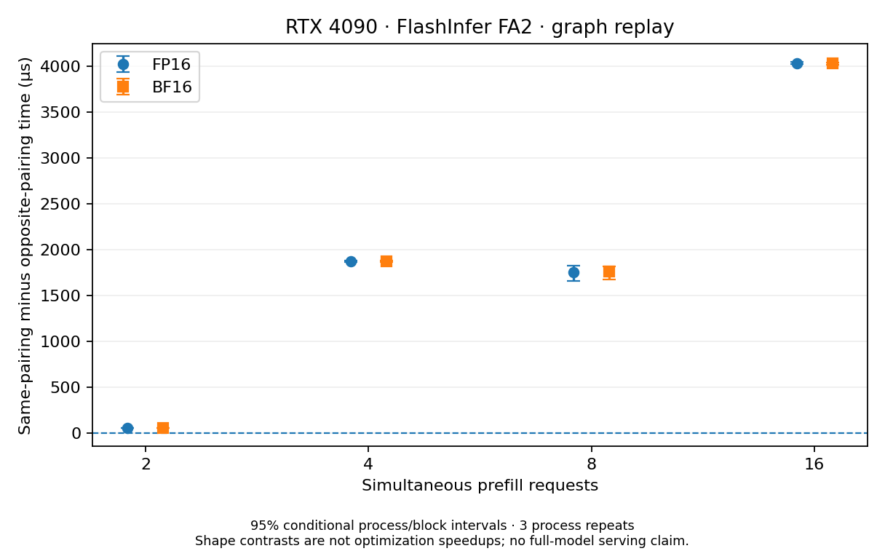
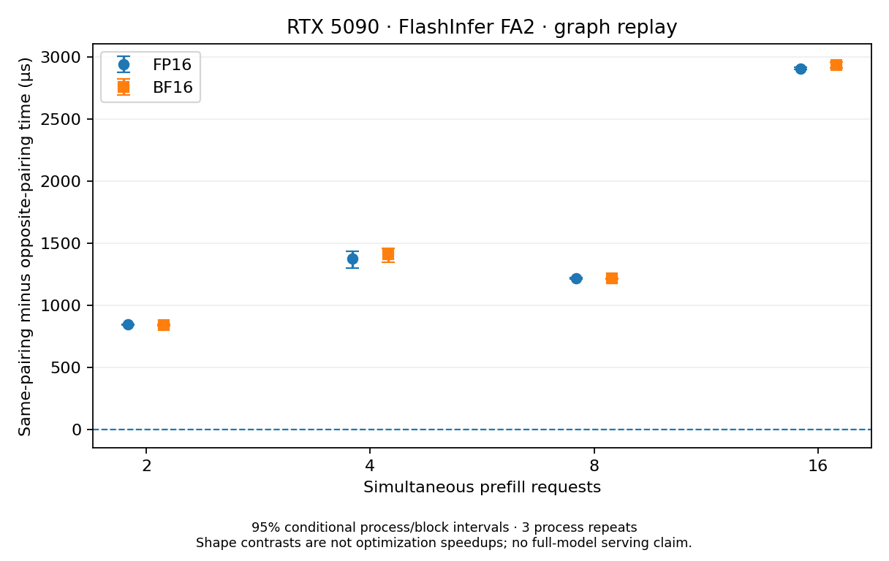
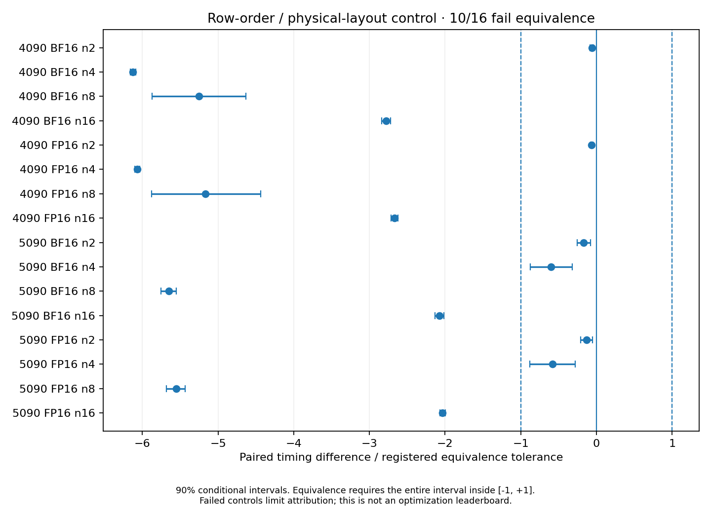
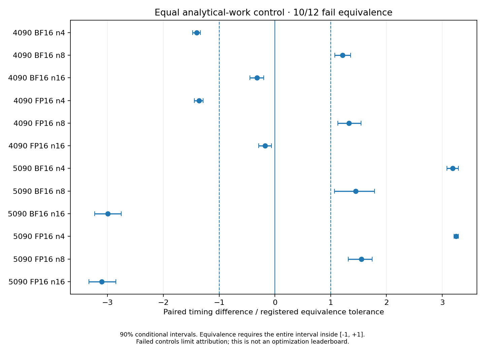

# Controlled Ada/Blackwell prefill permutations

**Complete: six formal GPU runs,20,736 timing records, all retained.**

[Interpretation and failed controls](INTERPRETATION.md) · [Complete primary table](RESULTS.md) · [Canonical JSON](summary.json) · [Registered protocol](PROTOCOL.md)

## What the result establishes—and does not

All16 auto/graph same-versus-opposite pairing contrasts have positive conditional 95% intervals. But **10/16 row-order controls and10/12 equal-work controls fail the registered equivalence criterion**. Pairing is relevant; scalar analytical work and unordered request pairs do not fully explain execution cost in this assay.

**This is a real-GPU kernel study, not a new optimizer or a full-model speedup.** The existing full-engine-v2 no-promotion result is unchanged. The original A100 full-engine permutation experiment is not completed by this artifact.

Measured scope: RTX 4090/5090, FlashInfer 0.6.18 explicit FA2,32 query heads / 8 KV heads, D128,FP16/BF16,eager and graph replay,2/4/8/16 prefills. Auto and unsplit are stock-backend explanatory controls. Three processes perGPU family and twelve paired randomized blocks; no post-hoc outlier removal.

## Validation and cost

The formal matrix completed864 state/arm qualification records,723,456selected FP32-vector checks and12,096 exact graph/eager output checks.31 CPU contract tests and108 hash-pinned Vidur feature-map calls are reproducible offline. Total allocation including canaries: **1.248611 GPU hours**, not a price estimate. See [resource accounting](resource-accounting.json), [canary gate](qualification.json), and [completion receipt](COMPLETE.json).

## Figures: effects and their limits






Both dtypes and every registered primary condition are shown. Dashed control boundaries are the preregistered equivalence tolerance, not confidence bounds.

## Reproduce without a GPU

From this directory, with Python 3.9 or later:

```bash
python reproduce.py
python reproduce.py --archive raw-evidence.tar.gz \
  --extract-to /tmp/sgi-permutation-data-NEW \
  --out /tmp/sgi-permutation-analysis-NEW
cmp summary.json /tmp/sgi-permutation-analysis-NEW/summary.json
cmp RESULTS.md /tmp/sgi-permutation-analysis-NEW/RESULTS.md
```

Use new output directories; existing outputs are never overwritten. Core analysis needs only the Python standard library. The2.1 MB [raw archive](raw-evidence.tar.gz) is checksum-verified against [data-manifest.json](data-manifest.json). The analyzer rejects incomplete matrices, failed-job markers, duplicate or mismatched trial IDs, changed geometries, source/hash mismatches and missing qualification records.

A fresh extraction and analysis on the Mac reproduced the JSON and table byte for byte: [receipt](offline-reproduction.json), [log](offline-reproduction.log). This is analysis reproduction by the same workflow, not independent third-party GPU replication.

Optional figure generation, in a separate environment:

```bash
python -m pip install -r plot-requirements.txt
python plot_results.py --summary summary.json --out /tmp/sgi-permutation-figures-NEW
```

## Source and novelty boundaries

[Representation audit](representation-audit.json) verifies that adding total-KV-length second moments can recover analytical work without a full pair list. [Vidur audit](vidur-source-audit.json) executes two real, hash-verified upstream feature methods; it is not a trained simulator-accuracy benchmark. The [unmodified MIT-licensed reference source](reference_sources/vidur/README.md) is third-party code, not original project code.

Measurement source was frozen before GPU execution at commit `6d4d1242f07b69948914a9d6548e8c1589d49641`; `campaign.py` SHA256 is `a5c9995b3d3ad442977ac1fdd0609741384124d7eb6c1561395a77f51710287a`. The analysis implementation and checks evolved without changing GPU source, endpoints or exclusions. All details, environment variation, failed controls and prior-art limits are retained in [INTERPRETATION.md](INTERPRETATION.md) and [DESIGN_NOTES.md](DESIGN_NOTES.md).
