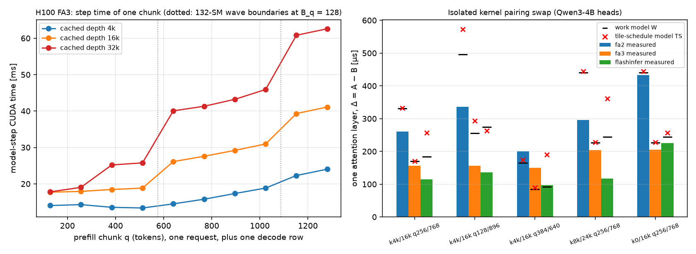

# Prefill cost geometry on Hopper (H100, FA3), a second engine, and where the single slope breaks

**Questions.**
1. The pairing swap and the attention-work law were measured on FA2 (L20, A100). vLLM on an H100
   runs FlashAttention 3, a different kernel family (warp-specialized, persistent, asynchronous).
   Does the pairing effect survive?
2. Is it a vLLM effect, or does another engine with its own scheduler and runtime show the same
   cost?
3. The single-slope prediction of the pairing Δ failed on the A100 (PS1). Why?
4. Two published predictors, Vidur's attention key and the LLMVisor formula, are aggregate. How far
   are they from M2n on the same splits?

**Answers.**
1. **Yes.** On the H100, swapping only the pairing changes the vLLM model step by **+5.3 to +10.2 ms**
   (Qwen3-4B) and **+5.4 to +10.5 ms** (Qwen3-8B), in the predicted direction in 10 of 10
   configurations; the ΔW = 0 controls move by −0.11 and −0.02 ms. The partition gap is **1.80×**
   (4B) and **1.48×** (8B). M2n predicts geometry-OOD steps to **1.7–2.5 ms MAE** on all four models
   (M0 19–57 ms, LPRS-style MLP 23–53 ms).
2. **Not vLLM-specific.** SGLang 0.5.20 (also FA3 on Hopper, but a different scheduler, batch
   format and runtime, and no decode row in its extend batch) gives **+5.6 to +10.7 ms**, within
   **2–5%** of vLLM on every configuration. The effect is also present in every isolated kernel
   tested: vLLM FA2, vLLM FA3 and FlashInfer, for two attention shapes. 36 layers of the isolated
   FA3 Δ account for **72–102%** of the model-step Δ.
3. **On Hopper the cost of a chunk is quantized in waves of deep CTAs, not linear in work.** One
   chunk at depth 16k costs 18.8 ms at 512 tokens and 26.1 ms at 640; from 640 to 1024 it rises only
   4.8 ms, then jumps 8.3 ms at 1152. At 32k the jumps double (14.3 and 14.9 ms). These are
   exactly the 132-SM wave boundaries of 128-row query tiles × 32 heads, and they were predicted
   before the sweep ran. The pairing Δ is therefore close to one wave jump, whatever ΔW is. The
   single-slope ratio scatters on both sides of 1 (0.76–1.58), unlike the A100's consistent 0.65–0.89.
   Two pre-registered mechanisms for the A100 failure are **refuted**: a costlier self term, and the
   tile-schedule packing model as specified.
4. **Vidur is blind to the swap by construction** (floor |Δ|/2 = 2.7–5.3 ms on the H100, 3.5–14 ms on
   the A100, 9–27 ms on the L20). **LLMVisor is much better than M0** (primary split 3–20 ms, not
   56–340) because it has no Σq·Σk interaction, but it is still 1.4–9.1× M2n; the pre-registered
   ≥5× held on only 5 of 11 datasets.

Pre-registered in [`docs/preregistration/2026-09-27-h100-hopper-replication.md`](../../../docs/preregistration/2026-09-27-h100-hopper-replication.md)
(`c68a67d`, pushed before any H100 timing; addenda 1–4 each pushed before the data they concern).
Every verdict below is against that file, including the failures.

## Provenance

| item | value |
| --- | --- |
| hardware | RunPod, 1× NVIDIA H100 80GB HBM3 (SXM, 132 SMs), driver 580.126.09 ([`raw/*/nvidia-smi.txt`](raw/Qwen3-4B/nvidia-smi.txt)) |
| vLLM | 0.29.0, torch 2.13.0+cu130, tracer v2 via `apply_tracer_v2.py` (unchanged); "Using FlashAttention version 3" in every server log ([`raw/*/server-part-1x1024.log`](raw/Qwen3-4B/server-part-1x1024.log)) |
| SGLang | 0.5.20 (same torch), default attention backend: `fa3` on Hopper MHA without speculation (`sglang/srt/arg_groups/model_override_base.py`) |
| models | Qwen3-4B, Qwen3-8B, Qwen2.5-1.5B-Instruct, Qwen2.5-7B-Instruct (bf16, Hub) |
| cells | the A100 cells unchanged: 6 partition, 4 context, 3 load, 2 skew; 3 repeats, fresh server per cell ([`campaign/campaign_h100_shape.sh`](campaign/campaign_h100_shape.sh)) |
| lab commits | shape and vLLM pairing swap `c68a67d`; kernel `edc5bff`; SGLang and staircase `ea4384f`; all clean trees |
| reproduce | `PY=python bash benchmarks/results/h100-prefill-cost-geometry/campaign/analyze_h100.sh` regenerates every summary here from `raw/`; each `steps.csv` regenerates byte-identically from the gzipped traces, and both vLLM `pairswap.json` from theirs |

**Two environment incidents, both kept out of the data.**
- SGLang JIT-compiles a RoPE kernel and needs a CUDA toolkit; `apt-get install cuda-nvcc-13-0 …`
  switched the pod's `/usr/local/cuda` alternative from the pre-installed 12.8 to 13.0. vLLM's
  FlashInfer sampler then recompiled against 13.0, failed (no `curand.h`), and the engine did not
  start. The staircase and the first ordering run of that window never produced a step; they are
  kept aside, not analyzed. The alternative was set back to 12.8 (checked by the later queue), the
  sampler recompiled against 12.8 as in the original campaign, and both were re-run. Every result
  here comes from a 12.8 default except SGLang, which uses `CUDA_HOME=/usr/local/cuda-13.0` only
  for its own JIT.
- SGLang's first harness submitted the two requests separately; they arrived in different extend
  batches. The harness now submits each pair as one batched request, and all 120 trials per run
  landed in one step. Smoke numbers were discarded.

## 1. Pairing swap on Hopper, two engines ([`raw/pairswap-*`](raw/), [`raw/sglang-pairswap-Qwen3-4B`](raw/sglang-pairswap-Qwen3-4B/))

Δ = median(A) − median(B), model-step CUDA ms, 20 trials per state; A pairs the small chunk with the
shallow depth.

| config (k_a/k_b, q_a/q_b) | ΔW (M) | vLLM 4B | vLLM 8B | SGLang 4B | SGLang / vLLM |
| --- | ---: | ---: | ---: | ---: | ---: |
| 4k/16k, 256/768 | 6.29 | +7.49 | +7.60 | +7.68 | 1.03 |
| 4k/16k, 128/896 | 9.44 | +7.64 | +7.69 | +7.79 | 1.02 |
| 4k/16k, 384/640 | 3.15 | +5.30 | +5.39 | +5.58 | 1.05 |
| 8k/24k, 256/768 | 8.39 | +10.16 | +10.50 | +10.65 | 1.05 |
| 0/16k, 256/768 | 8.39 | +7.65 | +7.53 | +7.83 | 1.02 |
| control 4k/16k, 512/512 | 0 | −0.11 | −0.02 | −0.03 | — |

- **HP1, HP2, SG1, SG2, SG3 held.** SGLang has no decode row in the pair step and a different
  runtime, yet agrees to 2–5%. The cost lives in the attention kernel, not in the engine.
- **Δ does not track ΔW.** ΔW 9.44M costs the same as 6.29M; state A sits at 30.9–31.2 ms (4B) for
  deep chunks of 640, 768 and 896. See §3.
- **Error floor for any aggregate predictor** (|Δ|/2): 2.7–5.1 ms (4B), 2.7–5.3 ms (8B), 2.8–5.3 ms
  (SGLang), roughly 10–20% of these 21–48 ms steps.

## 2. Partition geometry and out-of-distribution prediction

Median step CUDA ms at 12–16k aggregate KV ([`partition.md`](partition.md)):

| model | 1×1024 / 2×512 / 4×256 | ratio | 1×2048 / 4×512 / 8×256 | ratio | slope (ms/M, 6 fits) |
| --- | --- | ---: | --- | ---: | --- |
| Qwen3-4B | 28.6 / 21.7 / 18.9 | 1.52× | 56.5 / 34.7 / 31.4 | **1.80×** | 1.00–1.12 |
| Qwen3-8B | 38.5 / 31.6 / 29.0 | 1.33× | 76.7 / 54.8 / 51.7 | **1.48×** | 1.01–1.21 |
| Qwen2.5-1.5B | 11.5 / 9.5 / 8.7 | 1.32× | 21.5 / 13.4 / 12.3 | 1.75× | 0.23–0.40 |
| Qwen2.5-7B | 33.2 / 28.1 / 25.8 | 1.29× | 66.1 / 50.2 / 48.2 | 1.37× | 0.79–0.94 |

- **HG1 held** (4B 1.80× in 1.6–2.4; 8B 1.48× in 1.3–2.0). The absolute gap at budget 2048 is 25 ms
  (4B), against 82 ms on the A100.
- **HG3 held** (4B slope 1.07 ms/M in 1.0–2.2; 8B within 5% of 4B). The H100 prices a unit of
  attention work at a third of the A100 (3.3) and a sixth of the L20 (6.5).
- **HG2 failed.** Within a budget the three partition slopes stay within 8% of their mean for 4B
  (both budgets), 1.5B (both) and the 2048 budget of 8B and 7B, but not at budget 1024 for 8B
  (−11.1%) and 7B (+8.8%). On FA3 the collapse onto one line is looser than on FA2 (1–4%).
- Decode-KV skew at equal aggregate: 4B skewed/balanced **1.063**, the other three 0.996–1.000
  ([`decode-kv-skew.md`](decode-kv-skew.md)). On the A100 all four models showed 3–9%. Still unexplained.

Primary split (train one-prefill, test multi-prefill), MAE ms, clean filters
([`m2-variants.md`](m2-variants.md), [`learned-baseline.md`](learned-baseline.md), [`split-term.md`](split-term.md),
[`published-predictors.md`](published-predictors.md)):

| model | M0 | LLMVisor | MLP (5 seeds) | M2s | **M2n** (signed) |
| --- | ---: | ---: | ---: | ---: | ---: |
| Qwen3-4B | 56.1 | 13.0 | 52.7 | 12.2 | **2.10** (+1.0) |
| Qwen3-8B | 56.8 | 20.1 | 47.6 | 14.2 | **2.53** (+2.0) |
| Qwen2.5-1.5B | 18.9 | 5.3 | 23.0 | 8.1 | **1.68** (−0.7) |
| Qwen2.5-7B | 44.4 | 18.6 | 37.8 | 14.7 | **2.04** (+1.4) |

- **HM1, HM2, HM3 held on all four models.** M2n reaches ≤ 5 ms with 32 one-prefill training steps;
  the MLP gets worse with more one-prefill data (4B: 24.6 ms at N = 32, 53.0 ms at 2048), as on the L20.
- **HM4 failed on all four.** Splitting attention work into cross and self terms (M2s) extrapolates
  badly: on one-prefill data the self term is nearly a function of the chunk size.
- **VL2 failed** (5 of 11 datasets across L20, A100 and H100 reach 5×). LLMVisor's Σp² and Σc terms
  do not contain the Σq·Σk interaction that makes M0 over-price multi-request steps, so its
  primary-split error is 3–20 ms, not hundreds. It is still 1.4–9.1× M2n, 3.3–29× on the reverse
  split, and blind to the pairing swap.

## 3. Why the single slope fails: wave quantization ([`staircase.md`](staircase.md), [`kernel-qwen3-4b.md`](kernel-qwen3-4b.md))

One prefill of q tokens at cached depth K, one decode row, 20 trials per q (addendum 4, predicted
before the sweep):

| K | 512→640 | 1024→1152 | median of the other 7 increments | rise 640→1024 |
| --- | ---: | ---: | ---: | ---: |
| 16k | **+7.28** | **+8.34** | 1.45 | 4.84 |
| 32k | **+14.30** | **+14.91** | 1.78 | 5.87 |
| 4k (control) | +1.13 | +3.45 | 1.20 | 4.34 |

- **ST1 and ST2 held; ST3 held narrowly** (the 4k boundary jump is 2.9×, just under 3×). The jumps
  sit where ceil(q/128) × 32 heads crosses 132 and 264 SMs, and their size doubles with depth: one
  wave of deep CTAs costs ≈ 0.45 ms per 1k of depth across 36 layers.
- **Not predicted:** a +6.15 ms step between 256 and 384 at 32k.
- **Consequence for the pairing swap.** State A (deep chunk 640–896) runs two waves of deep CTAs,
  state B (deep chunk 128–384) one. Δ ≈ one wave, which is why it does not scale with ΔW, and why
  the single slope over-predicts some configurations and under-predicts others (HP3 failed; 2 of 5
  in range on each model).
- **The pre-registered explanations did not survive.**
  - *Self term costs more (HP4, HP5).* The model-level c_S/c_X is 5–15 on the H100, but in the
    isolated kernels it is 0.34–1.21: the large model-level ratio is collinearity with per-token
    costs, not attention. HP4 failed (4B 3/5, 8B 4/5; the registration required each model).
  - *Tile-schedule packing (HK4, HK5).* An LPT packing of all CTAs onto 132 SMs, fitted on a coarse
    single-request grid, predicts the kernel pairing Δ worse than plain work on 4 of 6 (and only 0.5–3.7 µs better on the other two, FA2 and FA3 with the 7B shape)
    (kernel, shape) pairs and chose B_q = 64 from a grid whose chunk sizes all sit just below wave
    boundaries. Fixing B_q = 128 (exploratory, `--ts-tiles 128 128`) does not fix it. The wave
    structure is real (ST1), but this model of it is not quantitatively right.
- **Isolated kernels (HK1, HK2 held; HK3 failed).** Every kernel and both shapes show the swap
  (FA2 +200…+435 µs per layer, FA3 +148…+208, FlashInfer +97…+226; controls ≤ 1.9 µs).
  36 × the FA3 Δ is 72–102% of the model-step Δ, 5 of 5 in the 70–130% band. FA2 on the same GPU
  tracks work much more closely than FA3, so the quantization is a property of FA3's scheduling on
  this GPU, not of the H100 alone.

## Pre-registration outcomes

| item | outcome |
| --- | --- |
| HP1 existence, HP2 control (vLLM 4B, 8B) | held, held |
| HP3 single slope fails again (0.50–0.95 in ≥ 4/5) | **failed** in the other sense: 2/5 per model, ratios 0.73–1.58 on both sides of 1 |
| HP4 split term within ±25% (each model) | **failed** (4B 3/5; 8B 4/5) |
| HP5 c_S/c_X > 1.2 | held at model level (5.1–15); refuted as a mechanism by the kernels (0.34–1.21) |
| HG1 gap, HG3 slope | held, held |
| HG2 collapse within 8% | **failed** (8B and 7B at budget 1024) |
| HM1, HM2, HM3 | held on all four models |
| HM4 M2s ≤ M2n + 1 ms | **failed** on all four |
| HK1 kernel swap, HK2 closure | held, held (0.72–1.02) |
| HK3 kernel c_S/c_X > 1.2 for FA2 and FA3 | **failed** (FA3 1.21, FA2 0.78) |
| HK4, HK5 tile-schedule model | **failed** |
| SG1, SG2, SG3 (SGLang) | held, held, held (2–5%) |
| VL1 Vidur key invariant | held (by construction; floors above) |
| VL2 LLMVisor ≥ 5× M2n | **failed** (5 of 11) |
| ST1, ST2, ST3 staircase | held, held, held narrowly |

## Not known

- Why FA3 shows the 256→384 step at 32k, and why the 4B (not 8B, 1.5B or 7B) shows a decode-skew penalty.
- A tile-level model that predicts the FA3 pairing Δ within ±25%; FA3's scheduler metadata
  (`get_scheduler_metadata`) would be the place to read the actual assignment.
- H200/B200, FP8 KV, MoE and tensor parallelism.
