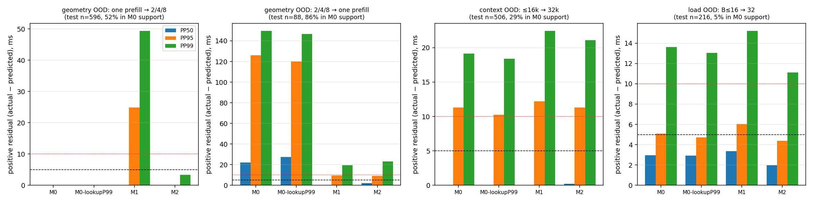
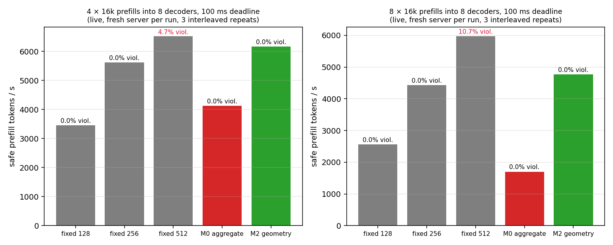
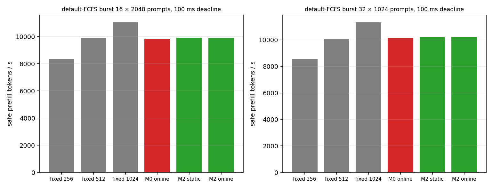

# When Token Budgets Lie: Request Geometry in Chunked LLM Prefill

**Problem.** Deadline-aware prefill schedulers price an iteration from an aggregate coordinate
(decode batch, aggregate KV depth, prefill tokens). On a real engine that coordinate can hide up to
**1.9× different execution cost**: 1×2048 prefill tokens vs 8×256 at identical decode batch, total
cached context and token count.

**Fix.** The cost is Σ qᵢ·kvᵢ, not (Σq)(Σkv). Use the per-request attention work
Σ qᵢ(kvᵢ + (qᵢ+1)/2) instead of the aggregate token × KV interaction. Six partition series collapse
onto one line (slopes within 4%).

**Result.** Geometry-out-of-distribution prediction MAE **341 ms → 8.3 ms** (P95 abs 1.2 s →
17.6 ms; reverse direction P95 under-prediction 126 ms → 9 ms). Live 100 ms-deadline controller on
vLLM 0.29 / L20 / Qwen3-4B: **+49–180% safe prefill progress** over the same controller on the
aggregate coordinate, at 0–0.3% violations, 3 interleaved repeats.

**Boundary.** Only **+5–12%** over a hindsight-tuned best fixed budget; **no gain** on ordinary
short-prompt FCFS bursts; context/load shift, decode-KV skew and CUDA-graph boundaries are all
handled by the aggregate coordinate. The finding is specific to iterations in which several
partially-prefilled requests with different KV depths share the budget.

| | |
| --- | --- |
|  |  |
|  |  |

Technical report: [`docs/when-token-budgets-lie.md`](../../../docs/when-token-budgets-lie.md).
Status: **frozen** at commit `17478ac` (research question answered). Everything below is the full
evidence: reproducible from `raw/` (JSON per run, JSONL traces per engine iteration and per runner
step) with the scripts linked; nothing in this directory was run on a dirty tree.

---

## Detailed question

Deadline-aware / SLO-aware chunked-prefill schedulers (SLOWeave-style budgeting, P-PAS-style
pressure rules) price a prefill step from an *aggregate* coordinate: decode batch size, aggregate
KV depth, candidate prefill tokens. Is that coordinate materially insufficient on a real vLLM
engine — i.e. do steps with the same aggregate coordinate cost materially different amounts — and
if so, does a cost model that sees the per-request geometry produce a measurable scheduling
advantage?

**Answer.** On one L20 running Qwen3-4B under vLLM 0.29, the aggregate coordinate collapses
partitions of the same prefill token budget that differ 1.4–1.9× in measured model-step time; a
single linear per-request attention-work term explains all of it; the aggregate predictor
mis-prices the unseen geometry by 126 ms P95 (under) or 1.2 s (over) depending on which geometry it
was fit on; and on the live engine a deadline controller carrying that term, calibrated only on
single-prefill data, finishes 4–8 concurrent 16k prefills 1.5–2.8× sooner than the same controller
on the aggregate coordinate at zero deadline violations either way — but only 5–12% sooner than the
best fixed budget chosen with hindsight (§5b), and not at all on default-FCFS short-prompt bursts
where steps hold one fresh prompt (§5c). Context shift (≤16k → 32k), decode-load shift (B ≤ 16 →
32), decode-KV skew at equal aggregate, and CUDA-graph capture boundaries are all handled by the
aggregate coordinate and are recorded here as negative results.

---

## 0. Provenance

| item | value |
| --- | --- |
| GPU / driver | NVIDIA L20 46 GB, driver 580.159.04 |
| runtime | vLLM 0.29.0 wheel + backported #54901 (compact sampling mask) + #57442 final patch (unused here), torch 2.13.0+cu130, CUDA 13.0 |
| experiment patches (site-packages, not upstream) | tracer v2 [`patches/apply_tracer_v2.py`](patches/apply_tracer_v2.py) / [`patches/exp_iter_trace_v2_0290.diff`](patches/exp_iter_trace_v2_0290.diff); controller [`patches/apply_deadline_controller.py`](patches/apply_deadline_controller.py) + [`patches/patch_tracer_exp.py`](patches/patch_tracer_exp.py) |
| model | Qwen3-4B (bf16), `--max-model-len 40960 --max-num-seqs 64 --no-enable-prefix-caching` |
| harness | [`scripts/measure_prefill_interference.py`](../../../scripts/measure_prefill_interference.py): B background decoders (128-token prompts unless stated, 4096 output tokens) + N injected long prefills; one fresh `vllm serve` per condition |
| lab commits | campaign17 `aacfac7`, campaign18 `395b189`, campaigns 19–20 `c8fb1b1`, campaigns 21–22 `caf127e` (clean trees; `provenance` block in every JSON) |
| campaign scripts | [`raw/campaign17.sh`](raw/campaign17.sh) … [`raw/campaign22.sh`](raw/campaign22.sh) (exact server/harness commands) |
| analysis | [`scripts/step_trace_join.py`](../../../scripts/step_trace_join.py), [`scripts/analyze_measurement_contract.py`](../../../scripts/analyze_measurement_contract.py), [`scripts/analyze_step_cost_v2.py`](../../../scripts/analyze_step_cost_v2.py), [`scripts/replay_prefill_controller.py`](../../../scripts/replay_prefill_controller.py), [`scripts/plot_prefill_geometry.py`](../../../scripts/plot_prefill_geometry.py) |
| upstream status | no upstream PR/issue/comment was opened or modified for this work; #57442 untouched |

Per-step data for every cell: [`steps.csv`](steps.csv) (3.3k prefill steps + decode steps; one row
per engine iteration with geometry, engine wait, CUDA time, graph mode). Fitted predictor report:
[`predictors.json`](predictors.json). Replay: [`replay-controllers.md`](replay-controllers.md) /
[`.json`](replay-controllers.json).

---

## 1. Measurement contract

Tracer v2 writes two JSONL streams per server: the **engine** stream (one row per scheduler
iteration: prefill request count, per-request chunk and KV depth, decode batch and KV depths,
totals, attention-work proxy, and `ms` = the engine's `future.result()` wait, which is **never**
used as GPU time) and the **runner** stream (one row per executed batch: CUDA event pair around
the model step, padded token count, cudagraph mode). Raw files: `raw/*/trace/<cell>.jsonl` and
`<cell>.steps.jsonl`.

**Join.** Runner rows are joined to engine rows by *sequence*, not timestamp: the runner executes a
constant number of warm-up batches before the engine trace starts (offset 4 everywhere), after
which token counts must match one-to-one. Over all 28 cells the match fraction is 1.0000 (e.g.
542/542, 488/488); the only unjoined row per file is the final in-flight iteration. A nearest-
timestamp join is wrong under async scheduling (the engine stamps ~1 step after the runner starts
the batch) and produced an apparent −25 ms gap-vs-CUDA discrepancy at 2048-token chunks that does
not exist — recorded here so nobody repeats it.

**Coverage** (campaign17, 3 interleaved on/off repeats; `measurement-contract.json`): engine
iteration indices are contiguous (0 gaps) in all 6 traced runs; every completed iteration has a
runner CUDA record.

**Host result-ready gap vs direct CUDA time** (aligned steps, 6 runs):

| step class | n | CUDA p50 | gap p50 | (gap − CUDA) p5 / p50 / p95 | corr |
| --- | ---: | ---: | ---: | ---: | ---: |
| decode-only | 2785 | 13.2 ms | 13.2 ms | −0.0 / +0.0 / +0.1 | 0.952 |
| prefill chunk 512 | 213 | 74.9 | 73.8 | −0.3 / 0.0 / +0.1 | 0.906 |
| prefill chunk 2048 | 54 | 248.0 | 248.0 | −4.6 / +0.0 / +0.1 | 1.000 |

The decode-facing step time the engine observes *is* the model-step CUDA time; all cost numbers
below use CUDA time. (The engine-wait `ms` field is 9.3 ms p50 on decode steps and 229 ms on
2048-chunk steps — a residual after overlap, reported only as such.)

**Trace on/off overhead** (campaign17; 8 decoders + 2×16k prefills; off/on interleaved ×3):

| condition | metric | off | on | on/off |
| --- | --- | --- | --- | ---: |
| chunk 512 | decode ITL p50 during injection | 60.9 / 61.8 / 61.6 | 62.2 / 62.6 / 62.2 | 1.014 |
| chunk 512 | decode ITL p95 | 102.6 / 101.2 / 100.5 | 100.9 / 100.7 / 101.0 | 0.994 |
| chunk 512 | long-request TTFT | 3.7 / 3.7 / 3.7 s | 3.7 / 3.7 / 3.7 s | 1.001 |
| chunk 512 | background tok/s during | 145.9 / 144.5 / 144.4 | 144.6 / 144.3 / 144.4 | 0.996 |
| chunk 2048 | decode ITL p50 / p95 | 19.9 / 324.4 | 19.9 / 323.6 | 1.002 / 0.999 |
| chunk 2048 | TTFT / tok/s | 3.3 s / 87.1 | 3.3 s / 87.0 | 1.001 / 1.006 |

Throughput within ±0.6% and latency within +1.4% (p50) / −0.6% (p95): inside the required
<1% / <2% envelope, at the edge on ITL p50 (three repeats each side agree to 0.5 ms, so the +1.4%
is a real ~0.9 ms of tracer cost on a 62 ms step, not noise).

---

## 2. Same coordinate, different cost — what moves the prefill-step time and what doesn't

All cells: Qwen3-4B, one L20, 3 repeats per cell (campaigns 18–19), CUDA time of steps that contain
prefill work. Full per-cell table in `predictors.json["cells"]`.

### 2.1 Context and decode load (aggregate effects — the coordinate already covers them)

512-token chunk, 8 decoders, two injected long prefills of length L:

| L | 4k | 8k | 16k | 32k |
| --- | ---: | ---: | ---: | ---: |
| 512-chunk step p50 / p95 | 47.7 / 55.5 ms | 55.9 / 71.8 | 74.6 / 104.3 | 105.1 / 144.7 |
| 2048-chunk step p50 / p95 | 163.0 / 192.5 | 190.5 / 245.6 | 240.5 / 350.8 | 349.2 / 558.5 |

The same chunk costs 2.2× more at 32k than at 4k — but this is KV-read depth, which the aggregate
coordinate carries (§3: a fair M0 with aggregate prefill-KV depth extrapolates ≤16k → 32k with
P95 positive residual 11 ms). Decode batch at fixed 16k prefill: B = 4 / 8 / 16 / 32 → 73.6 / 74.6
/ 75.1 / 76.3 ms p50 (each decoder adds ~0.1 ms to a prefill step; decode-only steps go 13.2 →
16.0 ms).

One aggregate subtlety worth recording: a *single* 32k decoder in the batch adds +36 ms to a
512-chunk prefill step at every depth (85.6 vs 48.9 ms at depth 0; 124.4 vs 91.0 at 12k) — 1.09 ms
per 1k of decode KV, which is 5× the per-token cost the same KV has inside a graph-captured
decode-only step (0.2 ms/1k: 13.2 → 19.6 ms for 2k → 35k aggregate). It is linear in the aggregate
decode-KV sum, so an aggregate model fit on prefill-containing steps captures it; it is *not*
captured by a proxy that weights decode rows as `q=1` FLOPs.

### 2.2 Decode-KV distribution at equal aggregate (control; negative)

8 decoders whose prompt KV sums to 32,768 either way: balanced 8×4096 vs skewed 4×7936 + 4×256
(`skew-bal`, `skew-skew`, 3 repeats):

| | balanced | skewed |
| --- | ---: | ---: |
| decode-only step, B=8, aggregate KV 34.6k | 19.58 ms p50 / 19.70 p95 | 19.48 / 19.62 |
| 512-chunk prefill step at 8k depth (B=8) | 91.2 / 98.6 | 92.7 / 98.2 |
| 512-chunk prefill step at 12k depth | 107.1 / 112.3 | 106.4 / 111.7 |

Decode-side geometry does not matter (differences ≤1.5%, inside repeat noise): the aggregate decode
KV sum is sufficient. **Killed:** "decode KV max/variance" as a scheduling feature.

### 2.3 CUDA-graph capture boundaries (control; negative)

Decode-only steps, batch C−1 / C / C+1 around capture sizes 8, 16, 24 (`graph-bg*`, 8 s windows,
2.4–2.9k steps each):

| batch | 7 | 8 | 9 (pads to 16) | 15 | 16 | 17 (pads to 24) | 23 | 24 | 25 (pads to 32) |
| --- | ---: | ---: | ---: | ---: | ---: | ---: | ---: | ---: | ---: |
| step p50 | 13.75 | 13.51 | 13.71 | 14.31 | 14.37 | 15.06 | 15.66 | 16.20 | 16.22 |

Crossing a capture boundary costs at most +0.7 ms (16 → 17) and often nothing; all steps stay
FULL-graph. **Killed:** graph-bucket features for decode-cost prediction. (Prefill-containing steps
over 128 tokens are eager; the "eager flag" is retained in M2 only for the ≤128-token tail chunks.)

### 2.4 Partition of the same prefill budget at equal aggregate coordinate (the positive result)

Same decode batch (8), same prefill tokens per step (1016–1024 or 2040–2048), binned by the
aggregate KV depth of the step (prefill + decode); one, two, four or eight long (16k) requests
share the budget via `--long-prefill-token-threshold` (`part-*`, `part2-*`, 3 repeats each):

| aggregate KV in step | 1×1024 | 2×512 | 4×256 | 1×/4× | | 1×2048 | 4×512 | 8×256 | 1×/8× |
| --- | ---: | ---: | ---: | ---: | --- | ---: | ---: | ---: | ---: |
| 0–4k | 87.7 ms | 82.3 | 79.9 | 1.10× | | 177.3 | 157.7 | 156.9 | 1.13× |
| 4–8k | 110.4 | 93.6 | 85.4 | 1.29× | | 229.3 | 171.6 | 162.0 | 1.42× |
| 8–12k | 138.7 | 107.7 | 91.9 | 1.51× | | 285.0 | 187.2 | 169.2 | 1.68× |
| 12–16k | 163.1 | 120.5 | 100.4 | 1.62× | | 336.1 | 200.4 | 178.9 | 1.88× |
| 16–20k | 179.8 | 134.1 | 105.5 | 1.70× | | — | 211.9 | 181.8 | — |

(n = 12 steps per filled bin, 3 for the 1×1024 16–20k bin.) At an identical aggregate coordinate the
step costs up to **1.7× (1024 budget) / 1.9× (2048 budget)** more when the tokens belong to one deep
request than when they are spread over 4–8 shallower ones. The gate ("≥20–25% median difference at
equal aggregate, ≥1.5× headline") is met from the 8k bin upward.

Why: per-request attention work is `q_i × kv_i`; the aggregate coordinate only knows `Σq_i` and
`Σkv_i`, and `(Σq)(Σkv) ≠ Σ q_i kv_i` unless there is one request. Regressing each series on the
proxy `Σ_i q_i·(kv_i + (q_i+1)/2)` alone:

| series | fit |
| --- | --- |
| 1×1024 / 2×512 / 4×256 | 77.9 + 6.38·M, 77.3 + 6.47·M, 77.5 + 6.55·M |
| 1×2048 / 4×512 / 8×256 | 150.6 + 6.39·M, 152.1 + 6.48·M, 152.5 + 6.65·M |

Six geometries, one slope (6.4–6.65 ms per M attention-work units, within 4%), intercepts set by
the token count. The right-hand panel of the figure is the same points against the proxy.

---

## 3. Predictors under explicit distribution shift

Ridge regression (λ = 0.01 on standardized features), fit on prefill-containing steps of the
training cells only, evaluated on the test cells only (never a random split). Target: model-step
CUDA time. `analyze_step_cost_v2.py`, full numbers in `predictors.json`.

| model | features |
| --- | --- |
| **M0** (strongest aggregate coordinate) | decode batch, aggregate decode KV, aggregate prefill KV-read depth, prefill tokens, prefill tokens × aggregate prefill KV |
| **M0-lookup** | conservative P99 table over (decode batch, prefill tokens/256, aggregate KV/4k) bins; unseen bin → M0 |
| **M1** (M0 + geometry statistics) | + prefill request count, prefill KV max/variance, largest chunk, tokens × KV max, decode KV max/variance |
| **M2** (physics-structured geometry) | aggregates (decode batch, decode KV, prefill KV, prefill tokens) + prefill request count + eager flag + padded tokens + per-request attention-work proxy **in place of** tokens × aggregate KV |

Deadline rule: admit a step if `prediction + q95(training residual) ≤ D` (nominal 5% miss target).
"miss" = admitted steps whose actual time exceeded D; "(safe%)" = fraction admitted.

### 3.1 Primary split — geometry OOD, aggregate in support

Train on every one-prefill step (2,498 steps, 15 cells: all contexts, loads, skew cells, 1×1024,
1×2048); test on the 2/4/8-prefill steps of the partition cells (596 steps; 52% of them have every
M0 coordinate inside the training range).

| model | MAE | med abs | P95 abs | underpred | pos. resid P50 / P95 / P99 | miss @100 ms (safe%) | @200 |
| --- | ---: | ---: | ---: | ---: | ---: | ---: | ---: |
| M0 | 341.1 | 201.4 | 1208.1 | 1% | 0.0 / 0.0 / 0.1 | 4% (4) | 0% (20) |
| M0-lookup | 345.4 | 210.4 | 1208.1 | 1% | 0.0 / 0.0 / 0.1 | 3% (6) | 0% (24) |
| M1 | 132.3 | 61.8 | 527.4 | 20% | 0.0 / 24.9 / 49.4 | 4% (11) | 0% (41) |
| **M2** | **8.3** | **6.8** | **17.6** | 3% | 0.0 / 0.0 / 3.3 | 3% (6) | 0% (54) |

Fit on one-prefill data, the aggregate model *over*-prices the multi-request geometry by hundreds
of milliseconds: it is "calibrated" in the underprediction sense (P95 positive residual 0) but
admits 4–20% of steps where M2 admits 6–54%. M1 — the naive "add geometry statistics" model —
fails too: on one-prefill data `KV max ≡ KV sum` and `largest chunk ≡ tokens`, so the fit cannot
tell the duplicated features apart and extrapolates wrongly. Only the physically structured M2
(one linear proxy term replacing the aggregate interaction) transfers.

### 3.2 Reverse split — fit on multi-prefill, test one-prefill (aggregate under-prices)

Train on the 2/4/8-prefill steps (596), test on the 1×1024 / 1×2048 steps (88; 86% in M0 support):

| model | MAE | med abs | P95 abs | underpred | pos. resid P50 / P95 / P99 | miss @100 ms (safe%) | @200 |
| --- | ---: | ---: | ---: | ---: | ---: | ---: | ---: |
| M0 | 37.0 | 22.0 | 126.0 | 76% | 22.0 / **126.0** / 149.6 | 0% (11) | 0% (70) |
| M0-lookup (P99, 86% bin hits) | 34.6 | 27.4 | 119.9 | 88% | 27.4 / 119.9 / 146.7 | **34% (40)** | 15% (93) |
| M1 | 6.0 | 4.0 | 15.5 | 23% | 0.0 / 9.6 / 19.4 | 0% (19) | 0% (78) |
| **M2** | 5.5 | 3.4 | 17.2 | 56% | 2.0 / **9.1** / 23.0 | 0% (23) | 0% (75) |

In-support rows only: M0 P95 positive residual 126 ms → M2 5.9 ms (−95%). The conservative P99
lookup — the SLOWeave-style safe table — turns a nominal ≤1% target into 34% misses at a 100 ms
deadline. Gate for continuing ("M1/M2 cut P95 underprediction ≥50%"): met.

### 3.3 Secondary splits — context and load (negative for the geometry hypothesis)

| split | model | MAE | P95 abs | pos. resid P50 / P95 / P99 | miss @100 (safe%) | @200 |
| --- | --- | ---: | ---: | ---: | ---: | ---: |
| context ≤16k → 32k (479 → 506 steps) | M0 | 3.3 | 12.5 | 0.0 / 11.3 / 19.1 | 0% (27) | 0% (83) |
| | M2 | 2.6 | 11.6 | 0.2 / 11.3 / 21.1 | 0% (30) | 0% (83) |
| load B ≤ 16 → 32 (677 → 216) | M0 | 3.2 | 5.5 | 3.0 / 5.1 / 13.6 | 0% (81) | 0% (100) |
| | M2 | 2.7 | 5.1 | 2.0 / 4.4 / 11.1 | 2% (90) | 0% (100) |

With aggregate prefill-KV depth in the coordinate (the fair M0 — not the `(decode batch, chunk)`
pair), context and load shift are *not* material failures: P95 positive residual 5–11 ms, nominal
5% → 0–2% actual misses at 100/200 ms. The earlier Phase-0 finding (56% false-safe at 32k) was a
predictor without the KV term; it is superseded. **Killed:** "KV depth matters" as a contribution.

---

## 4. Offline controller replay

`replay_prefill_controller.py`: closed-loop simulation of N 16k prefills arriving together with 8
decoders (KV 2–4k); each step a controller picks a prefill budget from {0, 64, …, 8192}, split
equally over the active prefills; step cost = an explicitly evaluated truth model fit on all 3,331
measured prefill steps (`6.8 − 1.6·tokens/k + 6.28·proxy_M − 1.5·B + 0.57·decodeKV_k + 0.08·prefillKV_k
+ 1.67·padded/k`; MAE 3.8 ms, residual q95 10.1 ms) plus a bootstrapped residual from the same
chunk-size class; 5 seeds. Decisions are labelled measured / interpolated / extrapolated against
the traced steps — every table below is 100% measured+interpolated (no extrapolated decisions)
except `fixed-4096/8192` and the P-PAS-style rule, which are all extrapolated and shown only for
completeness in `replay-controllers.md`. Controllers `*-one` are fit on one-prefill steps only
(the operator's realistic calibration set); `*-multi` on the multi-prefill cells.

Deadline 100 ms on prefill-containing steps (decode ITL is 13 ms; a 100 ms bound is the ITL SLO
the injected prefills are allowed to inflate to):

| controller | N=2: viol. / safe tok/s | N=4 | N=8 |
| --- | ---: | ---: | ---: |
| fixed-128 | 8.0% / 2,427 | 8.7% / 2,305 | 9.0% / 2,137 |
| fixed-256 | 11.1% / 3,523 | 9.9% / 3,523 | 10.7% / 3,316 |
| fixed-512 | 21.2% / 4,783 | 25.5% / 4,435 | 33.0% / 3,845 |
| M0 (aggregate, fit one-prefill) | 9.3% / 3,647 | **33.2% / 1,513** | **69.8% / 69** (never finishes) |
| M1 (fit one-prefill) | 9.1% / 4,573 | 8.6% / 3,898 | 15.5% / 2,411 |
| **M2 (geometry, fit one-prefill)** | **7.5% / 4,520** | **7.4% / 4,310** | **8.4% / 3,336** |
| M0 (fit multi-prefill; in-sample q95 = 56 ms) | 53.8% / 11 | 53.4% / 11 | 53.4% / 11 |
| M2 (fit multi-prefill; q95 = 4 ms) | 5.8% / 5,148 | 5.8% / 4,919 | 7.4% / 4,446 |

Deadline 200 ms: all deadline controllers ≤1% violations; safe progress M0-one 6,488 / 4,997 /
3,332 vs M2-one 6,928 / 6,711 / 6,413 (N = 2/4/8), best fixed (1024) 7,036 / 6,871 / 6,513 at
0.6 / 1.9 / 5.3% violations — at 200 ms the decisions are 90–100% measured/interpolated.

**Coverage caveat that changes how this table may be read.** Once a decision is labelled
*extrapolated* whenever any per-request chunk is smaller than the 5th percentile of per-request
chunks ever measured against a deep KV (256 tokens), 94–99% of the 100 ms decisions of every
controller are extrapolations: the trace set never measured 32–128-token per-request chunks
against 4–16k KV, and the live runs (§5) show the truth model over-prices exactly those (live
fixed-256 at N=4: 0% violations, replay: 9.9%). The replay therefore satisfied the "≥10% more safe
progress / ≥2× fewer violations" gate on extrapolated costs; it correctly ordered the controllers
(M2 > fixed > M0 at N ≥ 4) but not their magnitudes. The live A/B, not the replay, is the evidence
for §5.

Other limitations: one truth model (its own residual q95 of 10 ms is the floor every controller
pays), equal-split partition (with vLLM's default FCFS chunking, multi-request steps only arise
from short prompts and request tails; the equal split is what `--long-prefill-token-threshold`
produces), and a synthetic decode side (13.2 + 0.2 ms/k).

---

## 5. Live env-gated controller (A/B on the real engine)

[`patches/apply_deadline_controller.py`](patches/apply_deadline_controller.py) installs, into the
0.29.0 scheduler, a per-step prefill budget chooser gated on `VLLM_EXP_DEADLINE_MS`: it enumerates
the in-progress and waiting prefills (remaining tokens, KV depth) and the decoders (count, KV sum),
evaluates the candidate budgets {64 … 8192} split equally over the prefills through the exported
cost model (`models/m0-one.json` or `models/m2-one.json`, both fit on **one-prefill** steps only),
takes the largest budget with `prediction + q95 ≤ deadline` (smallest candidate if none), and sets
the step's token budget and per-request cap accordingly; `VLLM_EXP_FIXED_BUDGET` runs a fixed
budget through the same code path. The decision is written into the engine trace. Server:
`--max-num-batched-tokens 8192` (ceiling), otherwise as §0. Workload: 8 decoders (4096 output
tokens) + N × 16k prefills injected together; **one fresh server per run, conditions interleaved,
3 repeats** ([`raw/campaign20.sh`](raw/campaign20.sh)); deadline 100 ms. Metrics from the CUDA
trace and the harness ([`scripts/analyze_live_controller.py`](../../../scripts/analyze_live_controller.py),
[`live-controller.json`](live-controller.json)); "safe prefill tok/s" = prefill tokens in steps
under the deadline ÷ wall time of the injected-prefill phase (steps with all 8 decoders present,
so the background-prompt prefill at server start is excluded); TTFT = mean over the N injected requests;
mean (min–max) over the 3 repeats.

| N | controller | prefill steps | violations >100 ms | prefill step p95 / max | safe prefill tok/s | TTFT (s) | decoder ITL p95 / p99 during | budget p50 |
| ---: | --- | ---: | ---: | ---: | ---: | ---: | ---: | ---: |
| 4 | fixed-128 (4×32) | 544 | 0.0% | 53.5 / 55 ms | 3,458 (3,447–3,473) | 18.75 (18.67–18.81) | 54 / 55 | 128 |
| 4 | fixed-256 (4×64) | 272 | 0.0% | 61.8 / 70 | 5,625 (5,598–5,655) | 11.72 (11.62–11.78) | 62 / 64 | 256 |
| 4 | fixed-512 (4×128) | 136 | **4.4% (3.6–5.1)** | 99.5 / 108 | 6,516 (6,486–6,531) | 9.66 (9.63–9.68) | 99 / 108 | 512 |
| 4 | **M0 aggregate** | 360 | 0.0% | 54.7 / 91 | 4,132 (4,129–4,137) | 15.82 (15.75–15.97) | 54 / 58 | 128 |
| 4 | **M2 geometry** | 180 | 0.0% | 79.7 / 90 | **6,171 (6,051–6,232)** | **10.65 (10.62–10.69)** | 79 / 86 | 256 |
| 8 | fixed-128 (8×16) | 1,057 | 0.0% | 77.3 / 81 | 2,558 (2,552–2,565) | 50.44 (50.30–50.56) | 77 / 80 | 128 |
| 8 | fixed-256 (8×32) | 529 | 0.0% | 84.6 / 88 | 4,427 (4,421–4,433) | 29.70 (29.65–29.74) | 85 / 87 | 256 |
| 8 | fixed-512 (8×64) | 265 | **10.3% (9.4–11.0)** | 102.9 / 132 | 5,966 (5,925–6,025) | 19.77 (19.73–19.80) | 103 / 113 | 512 |
| 8 | **M0 aggregate** | 1,344 | 0.0% | 77.5 / 91 | 1,702 (1,697–1,707) | 77.02 (76.68–77.32) | 78 / 79 | 64 |
| 8 | **M2 geometry** | 408 | 0.0% | 83.0 / 89 | **4,769 (4,761–4,775)** | **27.67 (27.56–27.74)** | 83 / 86 | 256 |

Reading:

- **Geometry vs aggregate, same controller, same calibration data, same deadline:** M2 finishes the
  prefills in 10.65 s vs 15.82 s (N=4, −33%) and 27.7 s vs 77.0 s (N=8, −64%), i.e. +49% and
  +180% safe prefill progress, both at zero violations. The aggregate model over-prices the
  multi-request steps (as §3.1 predicted) and starves them at 64–128-token budgets. This is the
  hypothesis test, and it is decisive.
- **Geometry vs the best *safe* fixed budget** (fixed-256 — 0% violations at both N; fixed-512 is
  faster but violates 4.4% / 10.3%, above the ≤5–7% target at N=8 and at its edge at N=4): M2 is
  +9.7% / +7.7% in safe progress and −9% / −7% in TTFT. That is below the "≥15% better than the
  strongest safe baseline" bar set before the run. The fixed-256 budget is, however, chosen with
  hindsight for this workload (it violates 4× at 512 and wastes 40% at 128); M2 found the
  equivalent operating point without tuning, and stays 10–20 ms under the deadline at p95 (79.7 /
  83.0 ms) because it carries the one-prefill calibration margin (q95 13 ms) on top of a model
  that under-predicts these steps by ~4 ms — a calibration question, not a geometry one.
- Every repeat range is ≤3% of its mean; the ordering M2 > fixed-256 > M0 holds in all 3 repeats
  at both N.

Verdict against the pre-registered gates: **aggregate → geometry: pass** (violations equal at 0%,
progress +41% / +166%); **geometry → strongest safe fixed budget: fail** (+7–8%, target ≥15%).

---

### 5b. Calibration round — can the remaining slack be used? (campaign21)

Two changes, applied to every controller: a finer budget grid ({64, 128, 192, 256, 384, 512, 768,
1024, 1536, 2048, …}; the fixed baseline gets `fixed-384` for the same reason) and an **online
margin**: the controller attributes each result-ready gap to the batch it priced
(`update_from_output`, validated in §1 as equal to CUDA time) and replaces the static q95 by the
95th percentile of the last 64 realised residuals in the step's prefill-count bucket (static until
16 samples). Also run: the M2 fit on the multi-prefill cells with its thin in-sample q95 (4 ms) as a
"perfect calibration" bound, and M0 with the online margin as the control for "do online margins
alone rescue the aggregate coordinate". Same workload, deadline and protocol as above (fresh server
per run, interleaved, 3 repeats); [`live-calibration.json`](live-calibration.json).

| N | controller | violations >100 ms | prefill step p95 / max | safe prefill tok/s | TTFT (s) | final margin |
| ---: | --- | ---: | ---: | ---: | ---: | ---: |
| 4 | fixed-256 (anchor; c20: 11.72 s) | 0.0% | 62 / 64 | 5,619 | 11.76 | — |
| 4 | **fixed-384** (hindsight-tuned oracle fixed baseline) | 0.0% | 90 / 93 | 5,887 | 11.25 | — |
| 4 | M2, static q95, fine grid | 0.0% | 87 / 89 | 6,330 | 10.47 | 13.2 |
| 4 | **M2, online margin** | 0.3% (0–0.8) | 93 / 101 | **6,592 (6,554–6,627)** | **10.04 (10.01–10.06)** | 2.8 |
| 4 | M2 multi-fit "oracle" (q95 4 ms) | 4.2% | 99 / 104 | 6,363 | 9.71 | 4.1 |
| 4 | M0, online margin | 0.0% | 68 / 84 | 5,914 | 11.20 | −59 |
| 8 | fixed-256 | 0.0% | 84 / 87 | 4,453 | 29.56 | — |
| 8 | **fixed-384** | 0.0% | 94 / 97 | 5,742 | 22.97 | — |
| 8 | M2, static q95, fine grid | 0.0% | 85 / 89 | 5,163 | 25.38 | 13.2 |
| 8 | **M2, online margin** | 0.0% | 93 / 99 | **6,036 (6,028–6,049)** | **21.69 (21.65–21.71)** | 0.6 |
| 8 | M2 multi-fit "oracle" | 11.8% | 106 / 114 | 5,131 | 21.01 | 4.1 |
| 8 | M0, online margin | 0.0% | 81 / 89 | 4,145 (3,704–4,378) | 31.7 (30.2–34.7) | −33 (−108…+14) |

- The online margin does what it should: M2's p95 moves from 80–87 ms to 93 ms at both N with
  violations ≤0.3%, TTFT 10.04 / 21.69 s. Against the strongest safe fixed budget on the same grid
  (fixed-384, hindsight-chosen) that is **+12.0% / +5.1% safe progress, −10.8% / −5.6% TTFT** —
  closer to, but still under, the pre-registered 15%.
- Why the gap stays small here: with equal-split, homogeneous requests the step geometry is
  nearly constant within a run, so a hindsight-tuned oracle fixed budget also saturates the deadline
  (fixed-384 p95 90–94 ms). What the controller buys is adaptivity, not raw progress: the same
  controller is safe at N=4 and N=8, while the safe fixed budget moves (512 is 4.4% at N=4 and
  10.3% at N=8; 384 happens to be safe at both).
- The multi-fit "oracle" q95 (4 ms) is too thin on the live engine (4.2% / 11.8% violations):
  trace-fit residuals understate live step variance, which is why a margin must be learned online.
- **Online margins do not rescue the aggregate coordinate.** At N=4 the bucket quantile becomes a
  −59 ms bias correction and M0 reaches fixed-384 level (still −10% vs M2-online); at N=8 the
  margin swings between −108 and +14 ms across repeats and TTFT spreads 30–35 s, because M0's error
  grows with KV depth inside a run, which a per-count residual quantile cannot track.
  Calibration corrects residual error; it cannot recover information discarded by the state
  representation.

### 5c. Default-FCFS short-prompt bursts (campaign22) — where geometry does *not* matter

vLLM's default chunking fills requests in order; multi-request prefill steps then arise only when
the budget exceeds a request's remaining tokens. Workload: bursts of 16 × 2048-token or 32 ×
1024-token prompts into 8 decoders, fixed budgets run **natively** (`--max-num-batched-tokens`,
patch inactive), controllers pricing the FCFS partition (`VLLM_EXP_PARTITION=fcfs`), deadline
100 ms, 3 interleaved repeats; [`live-fcfs-bursts.json`](live-fcfs-bursts.json).

| burst | controller | violations | prefill step p95 / max | safe prefill tok/s | TTFT mean (s) | budget p50 |
| --- | --- | ---: | ---: | ---: | ---: | ---: |
| 16 × 2048 | fixed-256 | 0.0% | 31 / 32 | 8,339 | 2.12 | 256 |
| 16 × 2048 | fixed-512 | 0.0% | 54 / 55 | 9,920 | 1.80 | 512 |
| 16 × 2048 | **fixed-1024 (native)** | 0.0% | 98 / 100 | **11,042** | **1.66** | 1024 |
| 16 × 2048 | M2 static / M2 online / M0 online | 0.0% each | 85–90 / 90–96 | 9,910 / 9,891 / 9,826 | 1.80 / 1.79 / 1.79 | 768 |
| 32 × 1024 | fixed-256 † | 0.0% | 29 / 30 | 8,539 | 2.01 | 256 |
| 32 × 1024 | fixed-512 | 0.0% | 52 / 52 | 10,083 | 1.72 | 512 |
| 32 × 1024 | **fixed-1024 (native)** † | 0.0% | 95 / 96 | **11,317** | **1.57** | 1024 |
| 32 × 1024 | M2 static / M2 online / M0 online | 0.0% each | 85–94 / 88–96 | 10,221 / 10,205 / 10,147 | 1.68 / 1.68 / 1.69 | 768 |

† repeats 2–3; repeat 1 of these two runs (the first two runs after the scheduler reinstall)
contains a single 3.8 s step (CUDA events 3,826 / 3,860 ms on a step whose engine gap is 17 ms,
with a matching 3.9 s decoder stall) — a one-off warm-up/JIT-type event, not a scheduling
effect; all 34 other runs have max ≤101 ms. Full per-run values in the JSON.

Here the geometry term is irrelevant: at 100 ms the admissible budget (768) is below the prompt
length, so every step is a single fresh prompt at depth <2k — exactly the single-prefill
distribution both models were fit on — and M0 ≡ M2 (within 1%). The native fixed-1024 budget sits
at p95 95–98 ms and beats every controller by ~10% because the 13 ms margin keeps them at 768;
the online margin cannot help because the residual bucket for these shapes is already tight
(final margin 13.2–13.5 = static, never enough samples per run). **Scope statement:** the
aggregate/geometry collapse is a property of steps in which several *partially-prefilled*
requests with deep KV share the budget — fairness/threshold partitions, or the tails of several
long requests — not of fresh short-prompt bursts under FCFS chunking.

---

## 6. Negative results and killed hypotheses

| hypothesis | evidence | decision |
| --- | --- | --- |
| Host `future.result()` wait or result-ready gap can stand in for GPU time at large chunks | §1: gap = CUDA (p50 diff 0.0, corr 1.000) once joined by sequence; the −25 ms discrepancy was a join artifact | measurement contract fixed; gap usable, CUDA used anyway |
| Context shift (≤16k → 32k) breaks an aggregate predictor | §3.3: fair M0 P95 positive residual 11 ms, 0% misses at 100/200 ms | killed (Phase-0 claim superseded) |
| Decode-load shift (B ≤ 16 → 32) breaks it | §3.3: P95 positive residual 5 ms | killed |
| Decode KV distribution (balanced vs skewed at equal aggregate) changes step cost | §2.2: ≤1.5% | killed |
| CUDA-graph capture boundaries need a feature | §2.3: ≤0.7 ms at C → C+1 | killed |
| "Add geometry statistics" (KV max/var, chunk max) to the aggregate model | §3.1: M1 MAE 132 ms on unseen geometry — duplicated features are unidentifiable on one-prefill data | killed as stated; the working form is one physical proxy term |
| Uncertainty margins alone fix the aggregate model | §3.2: P99 lookup still 34% misses; §4: M0 fit on mixed geometry has q95 56 ms and never admits | not a fix — the coordinate, not the margin, is the problem |
| A 50 ms deadline is attainable with 8 decoders and 16k prefills | §4: every controller ≥13% violations; the smallest admissible chunk already costs ~45 ms | out of reach on this hardware; 100 ms used |
| Trace replay predicts live controller magnitudes | §4 vs §5: replay ran 94–99% extrapolated at 100 ms (small per-request chunks never traced) and over-priced them; it ordered the controllers correctly but predicted 1.6–1.9× over best-fixed where live gave 1.07–1.08× | replay is a screening tool only; live numbers are the result |
| Geometry-aware control beats an oracle-tuned fixed budget by ≥15% at 100 ms | §5: +8–10% with the static margin; §5b: +5–12% with an online margin and a finer grid, at ≤0.3% violations | not met; recorded as a negative result |
| Online residual margins alone rescue the aggregate coordinate | §5b: M0+online reaches fixed-384 level at N=4 (−10% vs M2-online) but is unstable at N=8 (margin −108…+14 ms, TTFT 30–35 s) | killed |
| A thin trace-fit margin (multi-fit q95 4 ms) transfers to the live engine | §5b: 4.2% / 11.8% violations | killed; margins must be learned online |
| Geometry matters for default-FCFS short-prompt bursts | §5c: M0 ≡ M2 within 1%; native fixed-1024 beats every controller by ~10% | killed — scope of the finding is mixed-depth multi-request steps |

---

## 7. Strongest defensible conclusion

On L20 / Qwen3-4B / vLLM 0.29, aggregate prefill coordinates are sufficient for ordinary
context/load shifts and short-prompt FCFS bursts, but alias partially-prefilled multi-request
geometries whose measured step costs differ by up to 1.9×. Replacing the aggregate token × KV
interaction with per-request attention work reduces geometry-OOD prediction error from hundreds
of milliseconds to single-digit milliseconds and yields 49–180% more safe prefill progress than an
aggregate deadline controller at essentially zero 100 ms violations; against a hindsight-tuned
oracle fixed budget, the gain is a more modest 5–12%.

**Status: frozen (2026-09-18).** The research question is answered; controller v3, campaigns
16–22, all negative results and this README are the reference. No further tuning, models, GPUs or
controller versions are planned under this artifact.
