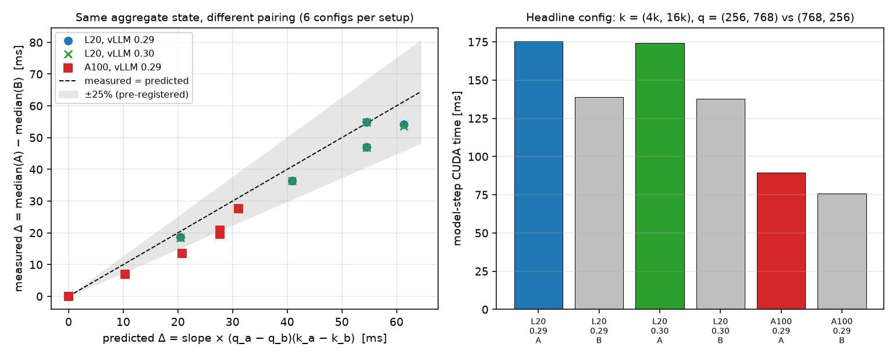
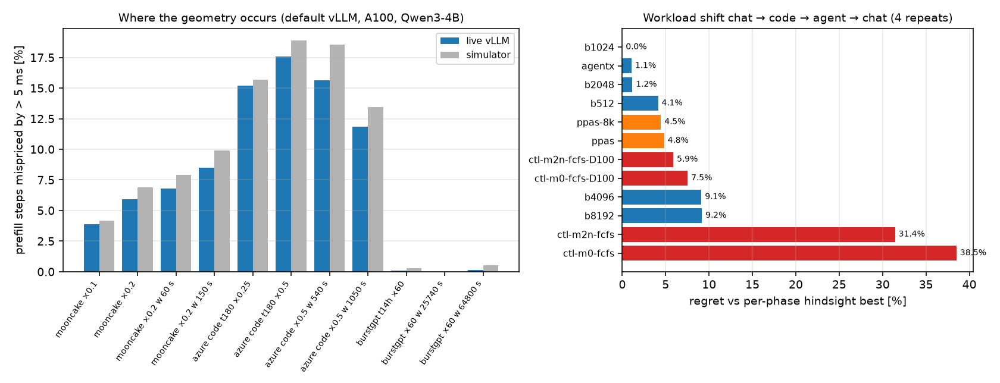

# When Token Budgets Lie: The Missing Pairing Information in Chunked-Prefill Cost Models

*Technical report. Experiments are frozen as of 2026-09-24. Every number comes from a checked-in
artifact under [`benchmarks/results/`](../benchmarks/results/README.md), and every prediction
tested here was committed first in
[`docs/preregistration/2026-09-23-m2-without-aggregate-prefill-kv.md`](preregistration/2026-09-23-m2-without-aggregate-prefill-kv.md).
Failed predictions are reported alongside the ones that held.*

## Abstract

Chunked-prefill schedulers decide each iteration's prefill budget from a cost model. The model's
input is an *aggregate* state: decode batch size, total KV depth and prefill token count, or
learned features built from them. We show that this state is missing information that the cost
depends on: which chunk is paired with which KV depth. The attention work of a step is
Σ qᵢ(kᵢ + (qᵢ+1)/2). An aggregate state determines (Σq)(Σk) and the marginals, but not Σ qᵢkᵢ.

We test this directly with a *pairing swap*: two engine steps with identical prefill count, Σq,
Σk, chunk multiset, depth multiset and decode state, which differ only in which chunk goes with
which depth.
- On vLLM with Qwen3-4B, the swap changes model-step CUDA time by 19–55 ms on an L20 and by
  7–28 ms on an A100, in the predicted direction every time. The control, where the swap changes
  nothing, moves by ≤ 0.09 ms.
- Any predictor on aggregate features therefore has an error floor of |Δ|/2 on these pairs,
  whatever its capacity.

The same law holds across two GPUs, five models and two vLLM releases:
- equal-aggregate partitions of one budget differ by up to 2.02×;
- every partition collapses onto one line against attention work.

Replacing the aggregate token × KV interaction with per-request attention work (M2n, specified
before the data it was tested on):
- cuts geometry-out-of-distribution error from 56–340 ms to 1.2–3.1 ms MAE on seven
  (GPU, model) datasets;
- reaches ≤ 5 ms with 64 training steps;
- beats an LPRS-style MLP, which stays at 40–232 ms.

On public request traces replayed live, 12–18% of prefill steps on code traffic and 4–9% on
agent traffic are mispriced by more than 5 ms; on chat traffic it is ≤ 0.1%. A simulator predicts
these rates within 0.3–3 points.

The result that bounds the contribution is negative. Better pricing inside a per-step deadline
controller does not produce better TTFT + TPOT goodput. On live traces a static budget chosen for
the SLO is best, P-PAS is within 5%, and the controllers lose (5.9–38.5% regret on a workload
shift). Geometry pricing always beats aggregate pricing *inside the same controller*, but per-step
budgeting cannot change the total work of a set of prefills. The contribution is a cost
representation, not a scheduler.

## 1. Introduction

A chunked-prefill scheduler adds prefill tokens to a decode batch each iteration. A
deadline-aware one picks the largest budget whose predicted step time fits a latency bound. The
predictor's input is usually an aggregate: SLOWeave-style schedulers price (decode batch,
aggregate KV, prefill tokens), and LPRS-style schedulers learn an MLP over similar features. Both
are implicitly assuming that steps with equal aggregates cost the same.

That assumption fails for one kind of step: several partially-prefilled requests at different KV
depths sharing the budget. Such steps are produced by threshold or fairness partitioning, by
prefix-cache hits that resume requests at depth, and by request tails. The cost of attention is
bilinear in each request's chunk and depth, and the aggregate state discards the pairing.

Contributions:
- **C1 (identifiability).** A formal statement of what an aggregate state can and cannot
  determine, and a live counterexample, the pairing swap, that isolates the missing term with
  everything else held equal (§3, §5).
- **C2 (physical law).** The partition gap and a single attention-work slope reproduce on two
  GPUs, five models and two vLLM releases. The slope scales with layers × query heads (§6).
- **C3 (representation).** One physically motivated term replaces the wrong interaction and
  gives single-digit-millisecond error out of distribution. A flexible learned model on
  aggregate features does not recover it (§7). The mispriced steps occur in real code and agent
  traffic at the rates a simulator predicts (§8).
- **C4 (negative result).** Better pricing does not become better SLO goodput through a per-step
  deadline controller, and we explain why (§9).

## 2. Background

**vLLM V1 scheduling (0.29).**
- Each iteration schedules running requests first, then waiting requests FCFS, up to
  `max_num_batched_tokens` (MBT; the A100 API server default is 2048).
- A prefill that does not fit is chunked and continues next iteration at a greater KV depth.
- `long_prefill_token_threshold` (default 0, off) caps the chunk per request, which spreads a
  budget over several long prefills.

**Where multi-request prefill steps come from.**
- Under default FCFS, one iteration holds several prefills only when the budget exceeds a
  request's remaining tokens: short prompts, request tails, or requests whose prefix is cached so
  that little is left to compute.
- Threshold and fairness policies (AgentX-style per-request caps, P-PAS) create them deliberately.

**Cost models in the literature.**
- Deadline schedulers price the next step from an aggregate state.
- Learned predictors (LPRS) fit an MLP on aggregate latency features.
- P-PAS (arXiv 2608.15171) switches between two prefill budgets by prefill and decode count, and
  uses no cost model.

## 3. Identifiability

For a step with prefill chunks qᵢ at KV depths kᵢ (i = 1…n), the attention work of the prefill
part is

  W = Σᵢ qᵢ(kᵢ + (qᵢ+1)/2) = Σᵢ qᵢkᵢ + Σᵢ qᵢ(qᵢ+1)/2.

The second term is a function of the chunk multiset. The first is not a function of any aggregate
or marginal statistic:

  Σᵢ qᵢkᵢ = (Σq)(Σk)/n + n·Cov(q, k).

The covariance between chunk size and depth, the pairing, is exactly what an aggregate state
discards. Two consequences follow.
- **Pairing swap.** Exchanging the chunks of two requests (q_a ↔ q_b) keeps every aggregate and
  marginal fixed and changes the work by ΔW = (q_a − q_b)(k_a − k_b).
- **Error floor.** A and B map to the same feature vector for any predictor f on aggregate or
  marginal features. On the pair, max(|f − t_A|, |f − t_B|) ≥ |Δ|/2, and the mean absolute
  error is at least |Δ|/2. More data or capacity cannot lower it; only a feature that sees the
  pairing can.

On single-prefill data (n = 1) the covariance is zero and (Σq)(Σk) = Σ qk. A model fit only on
single prefills cannot tell the two forms apart and extrapolates with whichever it happened to
use. §7 shows this is what happens.

## 4. Methodology

**Instrumentation.** An experiment patch to the installed engine (tracer v2, never upstreamed)
writes two traces:
- an *iteration* trace, one row per scheduler iteration, with per-request chunk and depth and
  decode batch and depths;
- a *step* trace, one row per executed batch, with a CUDA event pair around the model step,
  padded tokens and CUDA-graph mode.

Rows are joined by sequence, not timestamp. A timestamp join is wrong under async scheduling and
once produced a spurious −25 ms discrepancy. Over 28 cells the match fraction is 1.0000.
- **Agreement.** The host-observed result gap equals CUDA time at every step class (corr 1.000).
- **Overhead.** ≤ 0.6% throughput and ≤ 1.4% ITL p50.
- Details are in [`l20-prefill-cost-geometry/`](../benchmarks/results/l20-prefill-cost-geometry/README.md).

**Environment.**

| | L20 | A100 |
| --- | --- | --- |
| GPU | NVIDIA L20 48 GB | A100-SXM4-80GB (RunPod) |
| engine | vLLM 0.29.0; 0.30.0 for the replication | vLLM 0.29.0 |
| models | Qwen3-4B, Qwen2.5-1.5B-Instruct, Qwen2.5-7B-Instruct | Qwen3-4B, Qwen3-8B, Qwen2.5-1.5B-Instruct, Qwen2.5-7B-Instruct |

**Shape campaigns.**
- Background decoders (128-token prompts, 4096 output tokens) plus N long prefills injected
  together.
- Multi-request geometry is produced with `--long-prefill-token-threshold`.
- One fresh server per condition, conditions interleaved, three repeats.
- Cells: 6 partition cells (1024 tokens as 1×1024 / 2×512 / 4×256, and 2048 as 1×2048 / 4×512 /
  8×256), 4 context, 3 load and 2 decode-skew.

**Cost models.** All are ridge regressions (λ = 0.01, standardized features) on prefill-containing
steps.
- **M0** is the strongest aggregate coordinate: decode batch, aggregate decode KV, aggregate
  prefill KV, prefill tokens, and prefill tokens × aggregate prefill KV.
- **M2** is the published geometry model: aggregates, prefill count, eager flag, padded tokens,
  and Σ qᵢ(kᵢ + (qᵢ+1)/2) in place of the token × KV interaction.
- **M2n** is M2 without the aggregate prefill-KV term. It was pre-registered on 2026-09-23 before
  the new datasets were analyzed.
- **MLP** is an LPRS-style baseline: two hidden layers of 64, 16 aggregate and marginal features,
  5 seeds.

Splits are by cell, never random. The *primary* split trains on single-prefill steps and tests on
multi-prefill steps; the *reverse* split does the opposite. Pre-registered filters drop the first
iteration and steps > 10× their cell median.

## 5. The pairing swap (Figure 1)

*Figure 1. Left: measured step-time difference between states A and B against the difference
predicted from the partition-fit slope (L20 6.5, A100 3.3 ms per million attention-work units),
for 6 configurations per setup, including the ΔW = 0 control. Right: median model-step CUDA time
of the headline configuration. Qwen3-4B, one background decoder, 20 trials per state.*

**Construction.**
- Two prefixes at depths (k_a, k_b) are put in the prefix cache.
- Both requests (prefix plus a fresh suffix) are submitted together with `AsyncLLM` while one
  request decodes, with MBT = q_a + q_b + 1.
- The next step therefore executes exactly (q_a @ k_a, q_b @ k_b) plus the decode row. State B
  swaps the chunks.
- Each executed step is checked against the intended (chunks, depths). 94–100% of trials were
  captured.
- Script: [`scripts/measure_pairing_swap.py`](../scripts/measure_pairing_swap.py).

| setup | measured Δ (ms) | measured / predicted | control, ΔW = 0 | PS1 (±25%) | PS2 (\|control\| ≤ 1 ms) |
| --- | --- | --- | ---: | --- | --- |
| L20, vLLM 0.29 | +18.6 … +54.9 | 0.86 – 1.01 | −0.09 ms | held | held |
| L20, vLLM 0.30 | +18.5 … +55.0 | 0.86 – 1.01 | −0.05 ms | held | held |
| A100, vLLM 0.29 | +7.0 … +27.6 | 0.65 – 0.89 | +0.01 ms | **failed** (2/5) | held |

- **The counterexample holds on every setup.** It has the predicted sign in every configuration
  and a flat control.
- **The implied error floor** for any aggregate predictor is |Δ|/2: 9–27 ms on the L20 and
  3.5–14 ms on the A100.
- **PS1 failed on the A100.** The cross term costs 65–89% of what the partition-fit slope
  predicts there, against 86–101% on the L20. The single-slope proxy is therefore an
  approximation whose cross-term coefficient depends on the GPU. The sign and existence of the
  effect do not.
- vLLM 0.30 reproduces 0.29 to within 0.7 ms per configuration.

Three harness designs produced no data before this one; they are documented in
[`prefill-pairing-swap/`](../benchmarks/results/prefill-pairing-swap/README.md).

## 6. One physical law across hardware, models and releases

*Figure 2. L20, Qwen3-4B, vLLM 0.29, 8 decoders. Left: step CUDA time against aggregate KV depth
for six partitions of a fixed prefill budget. Right: the same steps against attention work
Σ qᵢ(kᵢ + (qᵢ+1)/2).*

Partition gap: 1×2048 against 8×256 (for the 7B and 1.5B models, the same budget partitions) at
equal decode batch, equal prefill tokens and aggregate KV 12–16k.

| GPU | model | vLLM | gap | artifact |
| --- | --- | --- | ---: | --- |
| L20 | Qwen3-4B | 0.29 | 1.88× | [`l20-prefill-cost-geometry`](../benchmarks/results/l20-prefill-cost-geometry/README.md) |
| L20 | Qwen3-4B | 0.30 | 1.87× | [`vllm030-replication`](../benchmarks/results/vllm030-replication/README.md) |
| L20 | Qwen2.5-1.5B | 0.29 | 1.83× | [`prefill-geometry-attention-shape`](../benchmarks/results/prefill-geometry-attention-shape/README.md) |
| L20 | Qwen2.5-7B | 0.29 | 1.37× | [`prefill-geometry-attention-shape`](../benchmarks/results/prefill-geometry-attention-shape/README.md) |
| A100 | Qwen3-4B | 0.29 | 2.02× | [`a100-prefill-cost-geometry`](../benchmarks/results/a100-prefill-cost-geometry/README.md) |
| A100 | Qwen3-8B | 0.29 | 1.62× | [`a100-prefill-cost-geometry`](../benchmarks/results/a100-prefill-cost-geometry/README.md) |
| A100 | Qwen2.5-1.5B | 0.29 | 1.82× | [`prefill-geometry-attention-shape`](../benchmarks/results/prefill-geometry-attention-shape/README.md) |
| A100 | Qwen2.5-7B | 0.29 | 1.48× | [`prefill-geometry-attention-shape`](../benchmarks/results/prefill-geometry-attention-shape/README.md) |

- **Collapse.** In every dataset, the partitions of one budget regress on attention work alone
  with one slope (within 1–4%). Intercepts are set by the token count.
- **Slope scaling.** Normalized per 1,000 layer·query-heads, the slope is 5.4–6.2 on the L20 and
  2.8–2.9 on the A100 at budget 2048. At budget 1024 the smaller models come out 11–34% above
  that, and that part of the slope prediction missed for 1.5B.
- **What does not move the cost** on the L20 (controls):
  - context length 4k → 32k is large but an aggregate quantity;
  - decode batch 4 → 32 at fixed prefill: +4%;
  - CUDA-graph capture boundaries: ≤ 0.7 ms;
  - decode-KV skew at equal total: ≤ 1.5%.
- **Decode-KV skew on the A100.** At equal total, skewed decode KV costs 3–9% more on all four
  models; on the L20 there is no effect on any of three models. Five tests ruled out the FA2
  decode kernel. The effect is recorded as measured but unexplained
  ([`scripts/analyze_decode_kv_skew.py`](../scripts/analyze_decode_kv_skew.py)).

## 7. Out-of-distribution prediction: M0, M2, M2n and a learned baseline

*Figure 3. L20, Qwen3-4B: P50/P95/P99 positive residual of M0, M1 (M0 + geometry statistics) and
the published M2 on four distribution-shift splits. The figure predates M2n and shows the
published M2. The M2n numbers are in the table below.*

**Primary split** (train on single prefills, test on multi-prefill steps), MAE in ms, with the
pre-registered filters:

| dataset | M0 | M2 (published) | M2n | MLP (5 seeds) |
| --- | ---: | ---: | ---: | ---: |
| L20 Qwen3-4B | 339.8 | 10.4 | **3.07** | 232.0 |
| L20 Qwen2.5-1.5B | 116.4 | 23.9 | **1.75** | 89.7 |
| L20 Qwen2.5-7B | 235.7 | 11.4 | **2.31** | 147.1 |
| A100 Qwen3-4B | 171.5 | 18.6 | **1.92** | 130.5 |
| A100 Qwen3-8B | 170.0 | 18.0 | **1.66** | 124.2 |
| A100 Qwen2.5-1.5B | 55.9 | 17.4 | **2.13** | 39.6 |
| A100 Qwen2.5-7B | 122.7 | 17.0 | **1.23** | 89.1 |
| L20 Qwen3-4B, vLLM 0.30 | — | 14.9 | 6.30 (H3 failed) | — |

**What the table shows.**
- **The aggregate model aliases geometry in whichever direction its data pushes it.** Fit on
  single prefills, M0 over-prices multi-request steps by hundreds of milliseconds, which starves
  them. Fit on multi-request steps (reverse split), it under-prices single prefills. On the L20 a
  "safe" P99 lookup table then turns a nominal ≤ 1% miss target into 34% actual misses at a
  100 ms deadline.
- **Adding geometry statistics does not fix it.** M1's MAE is 132 ms. On single-prefill data,
  max KV equals sum KV and the largest chunk equals the token count, so the duplicated features
  are unidentifiable.
- **The published M2's error was one term.** The linear aggregate prefill KV is nearly collinear
  with attention work on single-prefill data and runs 4× past its training range on multi-prefill
  steps. Dropping it (M2n) was pre-registered before the 1.5B and 7B data were analyzed; M2n then
  passed every criterion on both.
- **The learned baseline** sees every aggregate and marginal statistic but not the pairing
  ([`prefill-geometry-learned-baseline`](../benchmarks/results/prefill-geometry-learned-baseline/README.md)):
  - **Capacity does not help.** The MLP is off by 40–232 ms on the primary split and 49–296 ms
    on the reverse split, where it is worse than M0.
  - **Sample efficiency.** M2n reaches ≤ 5 ms with 64 single-prefill training steps. The MLP and
    M0 never reach it at any size up to 2,048, and the MLP sometimes gets worse with more
    single-prefill data (L20 4B: 147 → 244 ms).
  - **Exposure (exploratory).** With 25% of its training set drawn from other multi-prefill
    partitions, the MLP still misses unseen partitions by 10–49 ms, and M0 by 22–119 ms. M2n gets
    1.4–2.9 ms.
- **vLLM 0.30 (H3 failed).** 0.30 adds 2.2–4.0 s stalls to 17 prefill steps in 8 of 19 cells.
  Several fall under the pre-registered 10× exclusion and stay in the fit. A post-hoc 5×
  diagnostic gives M2n 2.80 ms, the 0.29 value; it is labelled post hoc, and H3 stays failed.
  Deferred CUDA-graph capture would produce this pattern, but that cause was not verified.

## 8. Prevalence in real traffic

*Figure 4. Left: share of prefill steps whose aggregate-coordinate mispricing exceeds 5 ms, live
default vLLM (A100, Qwen3-4B, prefix caching on) against the offline simulator, on primary and
robustness windows chosen by a frozen rule. Right: regret of each arm against the per-phase
hindsight best on a chat → code → agent → chat workload shift (§9).*

Setup ([`live-trace-replay`](../benchmarks/results/live-trace-replay/README.md)):
- **Traces:** Azure 2023 code and conversation, Mooncake tool-agent, BurstGPT.
- Requests carry synthetic token ids with the trace's lengths. Mooncake block hashes map to real
  512-token prefix-cache blocks.
- Each run has a 240 s arrival window and then drains.

| traffic | P(mispriced > 5 ms), live | simulator agreement |
| --- | ---: | --- |
| Azure code | 12–18% | within 0.3–3 points |
| Mooncake tool-agent | 4–9% | within 0.3–3 points; second jitter seed matches |
| BurstGPT chat | ≤ 0.1% | near zero in both |

- **V1 held.** Code and agent traffic are far above chat in every window.
- **V2 held in 10 of 13 cells.** It failed in 1 (BurstGPT, 0.1% vs 0.5%, both near zero), and
  2 cells were too close to zero for a ratio.
- **Where the mispricing comes from.** It follows the mechanism of §2: long code prompts leave
  tails that share steps, and agent turns resume at cached depth. Short chat prompts almost never
  put two partial prefills in one step.
- **Simulator.** [`trace-geometry-prevalence`](../benchmarks/results/trace-geometry-prevalence/README.md)
  is therefore a faithful proxy for where the geometry occurs. It is not a proxy for its effect
  on goodput.

## 9. Negative result: better pricing does not mean better scheduling

**Synthetic deadline workload: pricing matters.** The workload is 8 decoders plus N × 16k
prefills injected together, with a 100 ms deadline on the L20 and 65 ms on the A100. The
controller takes the largest budget whose predicted time plus margin fits.
- **M2n against M0:** 1.59× / 3.46× (L20, N = 4 / 8) and 2.38× / 4.80× (A100) the safe prefill
  throughput, at ≤ 0.6% violations.
- **Why M0 loses.** The aggregate controller is not unsafe; it is starved. It prices
  multi-request steps at several times their cost.
- **The published M2** collapses at A100 N = 8, where its aggregate prefill-KV term prices every
  candidate above the deadline.

*Figure 5. Every live controller run on both GPUs: safe prefill throughput against the share of
prefill steps over the deadline. Fixed budgets trace a frontier; M2n lands at its safe end
without tuning.*

**Against the best safe fixed budget, the gain is small.**
- L20: +11% / +3% over fixed-384.
- A100: −2% / +2% over fixed-512 in the main block, and +7% / +4% in the follow-up block.
- The pre-registered 15% bar was not met against these finer fixed grids.
- The controller's value in this setting is that it finds the right budget without tuning. The
  best budget differs by GPU (≈384 vs 512).

**On live traces the controller loses.** SLO: TTFT ≤ 5 s and TPOT ≤ 100 ms; goodput is requests
meeting both, per second.

| arm | Mooncake ×0.2 goodput (req/s) | workload-shift regret |
| --- | ---: | ---: |
| fixed 1024 | — | **0.0%** (best stock arm in every phase) |
| `default` (2048) | 0.98 | 1.2% |
| P-PAS (as published / 8k) | 0.98 / 0.98 | 4.8% / 4.5% |
| M2n controller, D = 100 ms | 0.24 | 5.9% |
| M0 controller, D = 100 ms | 0.13 | 7.5% |
| M2n controller, D = 65 ms | 0.06 | 31.4% |
| M0 controller, D = 65 ms | 0.06 | 38.5% |

- **Across cells.** No controller configuration beats the best static arm by more than 1% in any
  cell.
- **Across SLO pairs.** None is best under any of the nine (TTFT, TPOT) pairs tested
  ([`scripts/analyze_slo_sensitivity.py`](../scripts/analyze_slo_sensitivity.py)). The best
  static arm moves with the SLO (512 at 50 ms TPOT, 1024–2048 at 100 ms, 4096 or the AgentX cap
  at 200 ms), not with the workload phase.
- **The collapse is not only deadline tightness.** Aligning the deadline with the TPOT SLO
  (D = 100 ms) recovers Mooncake only to 0.24 req/s against 0.98 (pre-registered R5 failed).
  Filling every step to a deadline admits less prefill per second than the stock 2048 budget, so
  the queue grows.
- **The representation claim survives inside the controller.** M2n ≥ M0 in every live comparison
  and all nine SLO pairs (0.24 vs 0.13 req/s; 31% vs 39% shift regret).
- **Cost is not the explanation.** Cache-aware pricing, which prices waiting requests at their
  prefix-hit depth, fixes a real mispricing but not the objective. The controller decision costs
  p50 28–214 µs and p99 ≤ 231 µs, and is included in every measurement.

**Why: per-step budgeting cannot change total work.** Finishing a request of L tokens from depth
k₀ costs L·k₀ + L(L+1)/2 units of attention work however it is chunked. What a step-level policy
can change is the number of steps (fixed per-step cost) and the *order* in which requests finish.
[`scripts/analyze_allocation_horizon.py`](../scripts/analyze_allocation_horizon.py) runs the
A100 M2n deadline controller to completion under five within-step allocation policies, in three
scenarios: 4 × 16k fresh; a prefix-cached mix at depths 0/4k/12k/24k; and an agent resume with
one 16k fresh request and three 1k requests at 20k.
- **Makespan is equal within 1.4%** across equal split, shallowest-first, FCFS, SRPT by tokens
  and SRPT by cost.
- **A per-step oracle would still claim large savings.** Pricing each step against the cheapest
  allocation of the same budget on the equal-split trajectory claims 25.6% on the cached mix and
  9.2% on the agent resume. That saving is not realizable over the horizon: work moved out of one
  step reappears in a later one.
- **Mean TTFT is set by ordering.** SRPT reduces it by 18–49% at unchanged makespan, and a
  depth-greedy policy can double it (agent resume, 2.0×).

So accurate step pricing is necessary for any latency-bounded policy. It helps where the
objective is per-step (a deadline on every step, as in the synthetic A/B). A TTFT + TPOT goodput
objective is dominated by admission and ordering. A goodput-oriented scheduler that uses geometry
pricing for admission or TTFT-aware ordering was not built or tested here.

## 10. Related work and positioning

- **Aggregate deadline schedulers (SLOWeave-style).** We keep their control structure and replace
  the state. Our M0 is deliberately the strongest aggregate coordinate such a scheduler could
  use, not (decode batch, chunk). The failure is in the representation: calibration margins
  cannot recover it. On the L20 an online residual quantile given to M0 turned into a −59 ms bias
  correction and was unstable at N = 8.
- **Learned predictors (LPRS-style).** An MLP over aggregate features cannot beat the |Δ|/2
  floor of §3, and in our data does not approach M2n at any training size. A learned model with
  the attention-work feature would inherit the fix; the point is the feature, not the fitter.
- **P-PAS (arXiv 2608.15171).** It switches the budget by prefill and decode count without a
  cost model. On live traces it matches the best static arm on agent and chat traffic, is worse
  than `default` in both Azure-code robustness windows, and has 4.5–4.8% shift regret. It beats
  every deadline controller we ran. Our result does not compete with P-PAS as a policy. It gives
  a cost model that any such policy could price candidates with.
- **AgentX-style per-request caps** create exactly the multi-partial-prefill steps an aggregate
  predictor misprices. They also performed well as a static arm (1.1% regret).

## 11. Limitations

- **Engines and models.** vLLM only (0.29.0, and 0.30.0 for one replication); Qwen3 and
  Qwen2.5 dense models, 1.5B–8B, bf16; single GPU. No tensor parallelism, MoE, FP8 KV or
  speculative decoding.
- **Shape campaigns are synthetic.** They use random-token prompts, fixed decoders and prefills
  injected together, and the multi-request geometry is created with
  `--long-prefill-token-threshold`. The live traces use real lengths and arrival times but
  synthetic tokens and trace-given output lengths.
- **The single-slope proxy is approximate.** On the A100 the cross term costs 65–89% of the
  fitted slope (PS1 failed). The slope's scaling with layers × query heads missed at budget 1024
  for the smallest model.
- **Unexplained effects.** The A100 decode-KV skew (3–9%) and the vLLM 0.30 stalls are measured
  but not explained.
- **Fixed-budget baselines are chosen in hindsight.** Each is the best for its workload.
  Practitioners do not know them in advance; that is the controller's only demonstrated
  advantage in the synthetic setting.
- **Deviations from pre-registration.**
  - Some replay windows were corrected before use, and one window rule was relaxed (a 60 s gap
    for Azure code); both are recorded in addenda 7 and 7b.
  - The 65 ms A100 deadline was chosen from an offline replay that over-priced.
- **Experiment patches.** The tracer and controller patch an installed wheel and are not
  upstreamed.

## 12. Pre-registration record

The prediction file was committed before each block of runs, with 11 addenda. Outcomes are in
addendum 11.

| item | outcome |
| --- | --- |
| M2n on unseen shapes (1.5B, 7B; later L20 7B) | held on all |
| Pairing swap PS1 / PS2, L20 (0.29 and 0.30) | held / held |
| Pairing swap PS1 / PS2, A100 | **PS1 failed** / held |
| Learned baseline LB1, LB2 | held |
| A100 live controller: M2n vs M0 | held |
| A100 live controller: ≥ 15% over best safe fixed | **failed** |
| L20 live M2n: L1 / L2 / L3 | held / **failed** (+24% over M2, better than predicted) / held against the pre-registered arms, +3–11% over fixed-384 |
| vLLM 0.30: H1 / H2 / H3 | held / held / **failed** |
| Live replay R1–R6 | R3, R6 held; R1 held or tie; R2 mixed; R4 tie; **R5 failed** |
| Simulator vs live V1 / V2 | held / held in 10 of 13 cells, failed in 1 |
| Workload shift W1–W5 | **W1, W2, W4, W5 failed**; W3 held |
| Jitter robustness; controller overhead | robust; ≤ 231 µs p99 |

## 13. Conclusion and reproduction

Aggregate prefill cost models are missing one piece of information: which chunk is paired with
which KV depth. A live pairing swap measures that information directly, it follows one
attention-work law on two GPUs, five models and two vLLM releases, and it occurs in 4–18% of
prefill steps on real code and agent traffic. Replacing one interaction term fixes prediction
out of distribution where a learned aggregate model cannot. Better pricing, however, does not
become better TTFT + TPOT goodput through a per-step deadline controller: per-step budgeting
cannot change total work, and on live traces a static budget chosen for the SLO or P-PAS wins.
The contribution is the cost representation. Using it in admission or ordering is future work.

**Reproduction.** Each artifact README gives exact commands; raw traces are gzipped in each
`raw/`.

| section | scripts | artifacts |
| --- | --- | --- |
| §4 | `step_trace_join.py`, `analyze_measurement_contract.py` | `l20-prefill-cost-geometry` |
| §5 | `measure_pairing_swap.py`, `plot_paper_figures.py` | `prefill-pairing-swap` |
| §6 | `analyze_partition_geometry.py`, `analyze_decode_kv_skew.py` | `l20-prefill-cost-geometry`, `a100-prefill-cost-geometry`, `prefill-geometry-attention-shape`, `vllm030-replication` |
| §7 | `analyze_step_cost_v2.py`, `analyze_m2_variants.py`, `analyze_learned_baseline.py` | same, and `prefill-geometry-learned-baseline` |
| §8 | `simulate_geometry_prevalence.py`, `replay_trace_serving.py`, `select_replay_windows.py` | `trace-geometry-prevalence`, `live-trace-replay` |
| §9 | `analyze_live_controller.py`, `plot_live_pareto.py`, `analyze_trace_replay.py`, `analyze_slo_sensitivity.py`, `analyze_allocation_horizon.py` | `a100-prefill-live-controller`, `l20-prefill-live-controller-m2n`, `live-trace-replay` |

All scripts are in [`scripts/`](../scripts/); all artifacts are in
[`benchmarks/results/`](../benchmarks/results/README.md). Figures 1 and 4 are regenerated with
`python scripts/plot_paper_figures.py` from the repository root.
